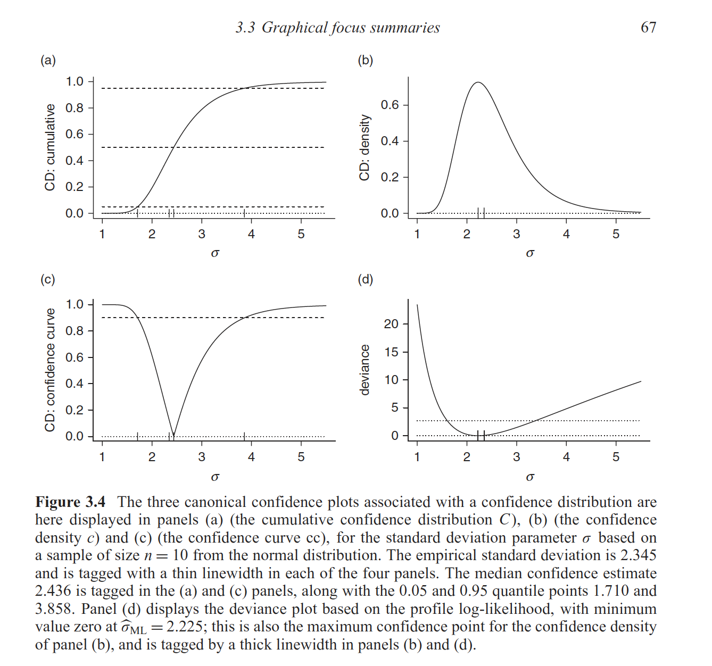

### <span style="color:#000; font-weight: 400;">`concurve`</span> | Graph Frequentist Distributions of Parameters </strong> 

* * * 

<!-- badges: start -->
[](https://CRAN.R-project.org/package=concurve)
[](https://www.tidyverse.org/lifecycle/#maturing)
[](https://cran.r-project.org/package=concurve)
[](https://cran.r-project.org/package=concurve)
[](http://www.rdocumentation.org/packages/concurve)
[](https://www.gnu.org/licenses/gpl-3.0)
[](https://travis-ci.com/zadrafi/concurve)
[](https://codecov.io/gh/zadrafi/concurve?branch=master)
<!-- badges: end -->

#### [Compute & Graph](https://data.lesslikely.com/concurve/reference/ggcurve.html)  Confidence Distributions and Likelihood Functions

<center>
<figure>
  
<figcaption><p style="font-size: 12px">Sample image taken from Schweder T, Hjort NL. (2016) </p></figcaption>
</figure>
</center>

* * * 
#### For A Better Understanding of What These Are, See the [Background Literature](https://data.lesslikely.com/concurve/articles/literature.html)

* * * 

#### [Compare](https://data.lesslikely.com/concurve/reference/plot_compare.html) The Functions From Different Studies 


* * *

#### [Export Tables](https://data.lesslikely.com/concurve/reference/curve_table.html) Easily For Word, Powerpoint, & TeX documents
<center>


* * * 

##### Install the package from [CRAN](https://cran.r-project.org/package=concurve) and check out the [articles](https://data.lesslikely.com/concurve/articles/index.html), which can also be found below.

(`It is highly recommended that you look at the articles.`)

```{r eval=FALSE}
install.packages("concurve")
```

Try the following script if you run into any installation issues:

```{r eval=FALSE}
install.packages("concurve", repos = "https://cloud.r-project.org/", dep = TRUE)
```

Install the developer version from [GitHub](https://github.com/zadrafi/concurve/) using the following: 

```{r eval=FALSE}
remotes::install_github("zadrafi/concurve@master", dependencies = TRUE)
```

See which versions of the package are currently [supported here](articles/supported.html). 

* * * 

#### Articles

##### Check out the [article on using `Stata`](https://data.lesslikely.com/concurve/articles/stata.html) to obtain similar functions.

* * * 

##### See the following articles:

* **[Comparison to Bayesian Posterior Distributions](https://data.lesslikely.com/concurve/articles/bayes.html)**
* **[The Bootstrap and Consonance Functions](https://data.lesslikely.com/concurve/articles/bootstrap.html)**
* **[Background Literature](https://data.lesslikely.com/concurve/articles/literature.html)**
* **[Customizing Plots](https://data.lesslikely.com/concurve/articles/customizing.html)**
* **[Examples in R](https://data.lesslikely.com/concurve/articles/examples.html)**
* **[Logistic Regression in R](https://data.lesslikely.com/concurve/articles/logistic.html)**
* **[Profile Likelihoods](https://data.lesslikely.com/concurve/articles/likelihood.html)**
* **[Meta-Analysis Examples](https://data.lesslikely.com/concurve/articles/meta-analysis.html)**
* **[Using Stata](https://data.lesslikely.com/concurve/articles/stata.html)**
* **[Survival Modeling](https://data.lesslikely.com/concurve/articles/survival.html)**
* **[S-values](https://data.lesslikely.com/concurve/articles/svalues.html)**
* **[Generating Tables](https://data.lesslikely.com/concurve/articles/tables.html)**
* **[Troubleshooting](https://data.lesslikely.com/concurve/articles/troubleshooting.html)**
* **[Consonance Functions for Linear Mixed-Effects Models](https://data.lesslikely.com/concurve/articles/variancecomponents.html)**
* **[Wish List](https://data.lesslikely.com/concurve/articles/wishlist.html)**

* * * 

### Citation

To properly cite the package, please see the [following page](file:///Users/zad/Desktop/GitHub/concurve/docs/authors.html) or run the R script below.

```{r eval=FALSE}
citation("concurve")
```

* * * 

### Code of Conduct
  
  Please note that the concurve project is released with a [Contributor Code of Conduct](https://data.lesslikely.com/concurve//CODE_OF_CONDUCT.html). By contributing to this project, you agree to abide by its terms.

##### Environment

The package was currently run on: 

```{r session_info, include=TRUE, echo=FALSE}
sessionInfo()
```

* * * 
