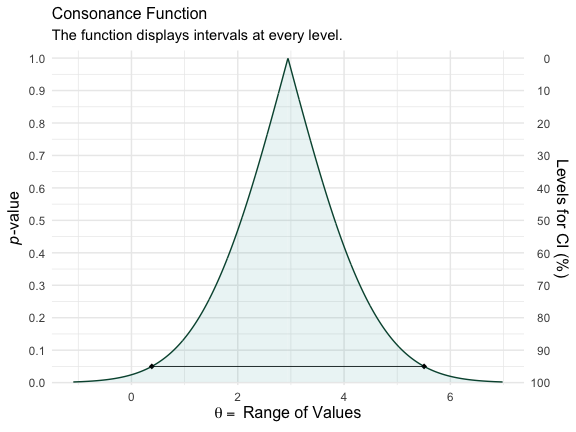
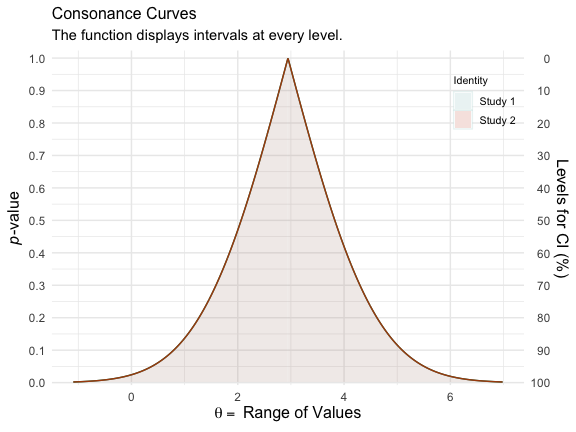
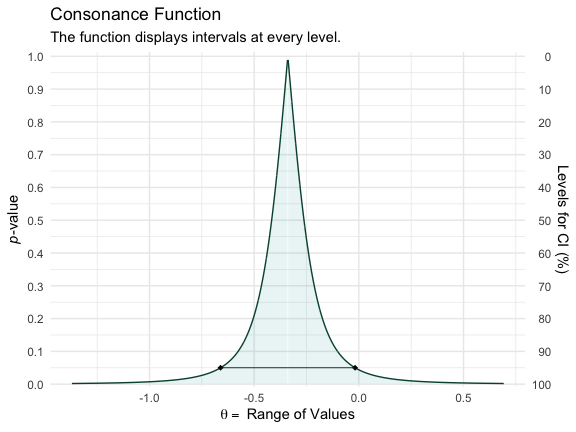
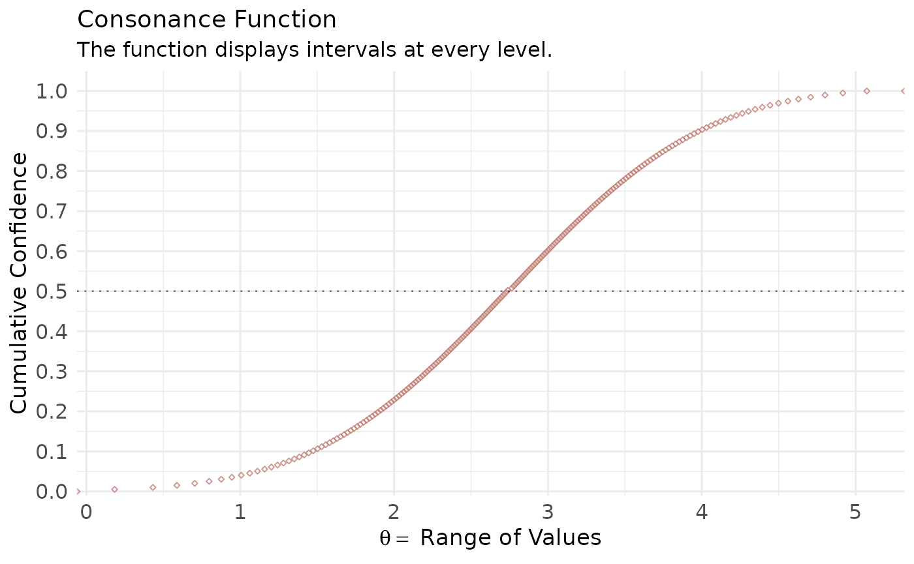

# Meta-Analysis Examples

## Simple Data Structures

Here, we’ll use an example dataset taken from the
[`metafor`](http://www.metafor-project.org/doku.php/analyses:normand1999)
website, which also hosts the very famous `metafor`
package.^([1](#ref-Viechtbauer2010-ss))

``` r

library(metafor)
#> Loading required package: Matrix
#> Loading required package: metadat
#> Loading required package: numDeriv
#> 
#> Loading the 'metafor' package (version 5.0-1). For an
#> introduction to the package please type: help(metafor)
library(concurve)
#> Please see the documentation on https://data.lesslikely.com/concurve/ or by typing `help(concurve)`
library(ggplot2)
dat.hine1989
#>   study         source n1i n2i ai ci
#> 1     1  Chopra et al.  39  43  2  1
#> 2     2       Mogensen  44  44  4  4
#> 3     3    Pitt et al. 107 110  6  4
#> 4     4   Darby et al. 103 100  7  5
#> 5     5 Bennett et al. 110 106  7  3
#> 6     6 O'Brien et al. 154 146 11  4
```

I will quote Wolfgang (the creator of the `metafor` package) here, since
he explains it best,

> “As described under help(dat.hine1989), variables **n1i** and **n2i**
> are the number of patients in the lidocaine and control group,
> respectively, and **ai** and **ci** are the corresponding number of
> deaths in the two groups. Since these are 2×2 table data, a variety of
> different outcome measures could be used for the meta-analysis,
> including the risk difference, the risk ratio (relative risk), and the
> odds ratio (see Table III). Normand (1999) uses risk differences for
> the meta-analysis, so we will proceed accordingly. We can calculate
> the risk differences and corresponding sampling variances with:

``` r

dat <- escalc(measure = "RD", n1i = n1i, n2i = n2i, ai = ai, ci = ci, data = dat.hine1989)
dat
#> 
#>   study         source n1i n2i ai ci     yi     vi 
#> 1     1  Chopra et al.  39  43  2  1 0.0280 0.0018 
#> 2     2       Mogensen  44  44  4  4 0.0000 0.0038 
#> 3     3    Pitt et al. 107 110  6  4 0.0197 0.0008 
#> 4     4   Darby et al. 103 100  7  5 0.0180 0.0011 
#> 5     5 Bennett et al. 110 106  7  3 0.0353 0.0008 
#> 6     6 O'Brien et al. 154 146 11  4 0.0440 0.0006
```

> “Note that the **yi** values are the risk differences in terms of
> proportions. Since Normand (1999) provides the results in terms of
> percentages, we can make the results directly comparable by
> multiplying the risk differences by 100 (and the sampling variances by
> $`100^{2}`$):

``` r

dat$yi <- dat$yi * 100
dat$vi <- dat$vi * 100^2
```

We can fit a fixed-effects model with the following

``` r

fe <- rma(yi, vi, data = dat, method = "FE")
```

Now that we have our `metafor` object, we can compute the consonance
function using the
[`curve_meta()`](https://stat.lesslikely.com/concurve/reference/curve_meta.md)
function.

``` r

fecurve <- curve_meta(fe, cores = 1L)
```

Now we can graph our function.

``` r

ggcurve(fecurve[[1]], nullvalue = TRUE)
#> Warning: Using `size` aesthetic for lines was deprecated in ggplot2 3.4.0.
#> ℹ Please use `linewidth` instead.
#> ℹ The deprecated feature was likely used in the concurve package.
#>   Please report the issue at <https://github.com/zadrafi/concurve/issues>.
#> This warning is displayed once per session.
#> Call `lifecycle::last_lifecycle_warnings()` to see where this warning was
#> generated.
```



We used a fixed-effects model here, but if we wanted to use a
random-effects model, we could do so with the following, where we can
specify a restricted maximum likelihood estimator (REML) for the
random-effects model

``` r

re <- rma(yi, vi, data = dat, method = "REML")
```

And then we could use
[`curve_meta()`](https://stat.lesslikely.com/concurve/reference/curve_meta.md)
to get the relevant list

``` r

recurve <- curve_meta(re, cores = 1L)
```

Now we can plot our object.

``` r

ggcurve(recurve[[1]], nullvalue = TRUE)
```


We could also compare our two models to see how much consonance/overlap
there is

``` r

curve_compare(fecurve[[1]], recurve[[1]], plot = TRUE)
#> [1] "AUC = Area Under the Curve"
#> [[1]]
#> 
#> 
#> | AUC 1| AUC 2| Shared AUC| AUC Overlap (%)| Overlap:Non-Overlap AUC Ratio|
#> |-----:|-----:|----------:|---------------:|-----------------------------:|
#> | 2.084| 2.084|      2.084|             100|                           Inf|
#> 
#> [[2]]
```



The results are practically the same and we cannot actually see any
difference, and the AUC % overlap also is consisten with this.

## Complex Data Structures

`concurve` can also handle complex data structures from `metafor` that
are clustered.

``` r


### copy data from Berkey et al. (1998) into 'dat'
dat <- dat.berkey1998

### construct list of the variance-covariance matrices of the observed outcomes for the studies
V <- lapply(split(dat[, c("v1i", "v2i")], dat$trial), as.matrix)

### construct block diagonal matrix
V <- bldiag(V)

### fit multivariate model
res <- rma.mv(yi, V, mods = ~ outcome - 1, random = ~ outcome | trial, struct = "UN", data = dat)

### results based on sandwich method
(a <- robust(res, cluster = dat$trial))
#> 
#> Multivariate Meta-Analysis Model (k = 10; method: REML)
#> 
#> Variance Components:
#> 
#> outer factor: trial   (nlvls = 5)
#> inner factor: outcome (nlvls = 2)
#> 
#>             estim    sqrt  k.lvl  fixed  level 
#> tau^2.1    0.0327  0.1807      5     no     AL 
#> tau^2.2    0.0117  0.1083      5     no     PD 
#> 
#>     rho.AL  rho.PD    AL  PD 
#> AL       1             -   5 
#> PD  0.6088       1    no   - 
#> 
#> Test for Residual Heterogeneity:
#> QE(df = 8) = 128.2267, p-val < .0001
#> 
#> Number of estimates:   10
#> Number of clusters:    5
#> Estimates per cluster: 2
#> 
#> Test of Moderators (coefficients 1:2):¹
#> F(df1 = 2, df2 = 3) = 41.6138, p-val = 0.0065
#> 
#> Model Results:
#> 
#>            estimate      se¹     tval¹  df¹    pval¹    ci.lb¹    ci.ub¹    
#> outcomeAL   -0.3392  0.1010   -3.3597    3   0.0437   -0.6605   -0.0179   * 
#> outcomePD    0.3534  0.0675    5.2338    3   0.0136    0.1385    0.5683   * 
#> 
#> ---
#> Signif. codes:  0 '***' 0.001 '**' 0.01 '*' 0.05 '.' 0.1 ' ' 1
#> 
#> 1) results based on cluster-robust inference (var-cov estimator: CR1,
#>    approx t/F-tests and confidence intervals, df: residual method)

l <- concurve::curve_meta(res, method = "uni", robust = TRUE, cluster = dat$trial, adjust = TRUE, steps = 1000, cores = 1L)

ggcurve(data = l[[1]], type = "c") +
  ggplot2::theme_minimal()
```



The interval function is quite narrow because there were so many
iterations that were set by us.

Here, we simulate a more complicated set of trials using the `simstudy`
package.

``` r

library(simstudy)
library(parallel)
library(nlme)
library(data.table)
#> 
#> Attaching package: 'data.table'
#> The following object is masked from 'package:concurve':
#> 
#>     :=
#> The following object is masked from 'package:base':
#> 
#>     %notin%
library(metafor)
library(concurve)

defS <- defData(varname = "a.k", formula = 3, variance = 2, id = "study")
defS <- defData(defS, varname = "d.0", formula = 3, dist = "nonrandom")
defS <- defData(defS, varname = "v.k", formula = 0, variance = 6, dist= "normal")
defS <- defData(defS, varname = "s2.k", formula = 16, variance = .2, dist = "gamma")
defS <- defData(defS, varname = "size.study", formula = ".3;.5;.2", dist = "categorical")
defS <- defData(defS, varname = "n.study",
                formula = "(size.study==1) * 20 + (size.study==2) * 40 + (size.study==3) * 60",
                dist = "poisson")

defI <- defDataAdd(varname = "y", formula = "a.k + x * (d.0 + v.k)", variance = "s2.k")

RNGkind(kind = "L'Ecuyer-CMRG")
set.seed(1031)

ds <- genData(12, defS)
ds
#> Key: <study>
#>     study      a.k   d.0        v.k      s2.k size.study n.study
#>     <int>    <num> <num>      <num>     <num>      <int>   <int>
#>  1:     1 4.745069     3 -5.1399796 16.275358          2      38
#>  2:     2 1.983020     3 -3.2693291 13.976232          3      66
#>  3:     3 1.865846     3  1.9742469  8.332148          2      40
#>  4:     4 4.235730     3 -3.2126873 11.100117          2      40
#>  5:     5 4.246219     3 -0.5858786 13.765175          3      57
#>  6:     6 3.899617     3  4.6808278  7.532707          2      41
#>  7:     7 3.059236     3 -5.9924638  7.817771          1      14
#>  8:     8 2.324586     3  5.7588246 10.970013          3      56
#>  9:     9 3.857260     3 -1.1081854 24.039016          3      75
#> 10:    10 4.308413     3 -1.9081253 14.084537          1      24
#> 11:    11 1.607899     3  0.2178001  8.271145          2      48
#> 12:    12 3.717728     3  1.8818612 11.274497          3      67

dc <- genCluster(ds, "study", "n.study", "id", )
dc <- trtAssign(dc, strata = "study", grpName = "x")
dc <- addColumns(defI, dc)


d.obs <- dc[, .(study, id,s2.k, x, y)]
d.obs <-  as.data.frame(d.obs)
res <- rma.mv(yi = y, V = s2.k, mods = ~  factor(study) + factor(x),  random = ~ factor(x) | study, struct="CS", data = d.obs, method = "REML")

a <- curve_meta(x = res, measure = "default", method = "mv", parm = "factor(x)1", cores = 1L)
ggcurve(a[[2]], type = "cdf")
```



## Cite R packages

Please remember to cite the packages that you use.

``` r

citation("concurve")
#> To cite package 'concurve' in publications use:
#> 
#>   Rafi Z, Vigotsky A (2026). _concurve: Computes and Plots
#>   Compatibility (Confidence) Intervals, P-Values, S-Values, &
#>   Likelihood Intervals to Form Consonance, Surprisal, & Likelihood
#>   Functions_. R package version 3.0.0,
#>   <https://CRAN.R-project.org/package=concurve>.
#> 
#>   Rafi Z, Greenland S (2020). "Semantic and Cognitive Tools to Aid
#>   Statistical Science: Replace Confidence and Significance by
#>   Compatibility and Surprise." _BMC Medical Research Methodology_,
#>   *20*, 244. ISSN 1471-2288. doi:10.1186/s12874-020-01105-9
#>   <https://doi.org/10.1186/s12874-020-01105-9>.
#>   <https://doi.org/10.1186/s12874-020-01105-9>.
#> 
#> To see these entries in BibTeX format, use 'print(<citation>,
#> bibtex=TRUE)', 'toBibtex(.)', or set
#> 'options(citation.bibtex.max=999)'.
citation("ggplot2")
#> To cite ggplot2 in publications, please use
#> 
#>   H. Wickham. ggplot2: Elegant Graphics for Data Analysis.
#>   Springer-Verlag New York, 2016.
#> 
#> A BibTeX entry for LaTeX users is
#> 
#>   @Book{,
#>     author = {Hadley Wickham},
#>     title = {ggplot2: Elegant Graphics for Data Analysis},
#>     publisher = {Springer-Verlag New York},
#>     year = {2016},
#>     isbn = {978-3-319-24277-4},
#>     url = {https://ggplot2.tidyverse.org},
#>   }
citation("metafor")
#> To cite the metafor package in publications, please use:
#> 
#>   Viechtbauer, W. (2010). Conducting meta-analyses in R with the
#>   metafor package. Journal of Statistical Software, 36(3), 1-48.
#>   https://doi.org/10.18637/jss.v036.i03
#> 
#> A BibTeX entry for LaTeX users is
#> 
#>   @Article{,
#>     title = {Conducting meta-analyses in {R} with the {metafor} package},
#>     author = {Wolfgang Viechtbauer},
#>     journal = {Journal of Statistical Software},
#>     year = {2010},
#>     volume = {36},
#>     number = {3},
#>     pages = {1--48},
#>     doi = {10.18637/jss.v036.i03},
#>   }
citation("simstudy")
#> To cite simstudy in publications, please use:
#> 
#>   Goldfeld K, Wujciak-Jens J (2020). "simstudy: Illuminating research
#>   methods through data generation." Journal of Open Source Software,
#>   5(54), 2763. doi:10.21105/joss.02763 (URL:
#>   https://doi.org/10.21105/joss.02763).
#> 
#> A BibTeX entry for LaTeX users is
#> 
#>   @Article{,
#>     title = {simstudy: Illuminating research methods through data generation},
#>     author = {Keith Goldfeld and Jacob Wujciak-Jens},
#>     publisher = {The Open Journal},
#>     journal = {Journal of Open Source Software},
#>     year = {2020},
#>     volume = {5},
#>     number = {54},
#>     pages = {2763},
#>     url = {https://doi.org/10.21105/joss.02763},
#>     doi = {10.21105/joss.02763},
#>   }
citation("nlme")
#> To cite package 'nlme' in publications use:
#> 
#>   Pinheiro J, Bates D, R Core Team (2026). _nlme: Linear and Nonlinear
#>   Mixed Effects Models_. doi:10.32614/CRAN.package.nlme
#>   <https://doi.org/10.32614/CRAN.package.nlme>. R package version
#>   3.1-169, <https://CRAN.R-project.org/package=nlme>.
#> 
#>   Pinheiro JC, Bates DM (2000). _Mixed-Effects Models in S and S-PLUS_.
#>   Springer, New York. doi:10.1007/b98882
#>   <https://doi.org/10.1007/b98882>.
#> 
#> To see these entries in BibTeX format, use 'print(<citation>,
#> bibtex=TRUE)', 'toBibtex(.)', or set
#> 'options(citation.bibtex.max=999)'.
citation("data.table")
#> To cite package 'data.table' in publications use:
#> 
#>   Barrett T, Dowle M, Srinivasan A, Gorecki J, Chirico M, Hocking T,
#>   Schwendinger B, Krylov I (2026). _data.table: Extension of
#>   `data.frame`_. R package version 1.18.4, <https://r-datatable.com>.
#> 
#> A BibTeX entry for LaTeX users is
#> 
#>   @Manual{,
#>     title = {data.table: Extension of `data.frame`},
#>     author = {Tyson Barrett and Matt Dowle and Arun Srinivasan and Jan Gorecki and Michael Chirico and Toby Hocking and Benjamin Schwendinger and Ivan Krylov},
#>     year = {2026},
#>     note = {R package version 1.18.4},
#>     url = {https://r-datatable.com},
#>   }
citation("parallel")
#> The 'parallel' package is part of R.  To cite R in publications use:
#> 
#>   R Core Team (2026). _R: A Language and Environment for Statistical
#>   Computing_. R Foundation for Statistical Computing, Vienna, Austria.
#>   doi:10.32614/R.manuals <https://doi.org/10.32614/R.manuals>.
#>   <https://www.R-project.org/>.
#> 
#> A BibTeX entry for LaTeX users is
#> 
#>   @Manual{,
#>     title = {R: A Language and Environment for Statistical Computing},
#>     author = {{R Core Team}},
#>     organization = {R Foundation for Statistical Computing},
#>     address = {Vienna, Austria},
#>     year = {2026},
#>     doi = {10.32614/R.manuals},
#>     url = {https://www.R-project.org/},
#>   }
#> 
#> We have invested a lot of time and effort in creating R, please cite it
#> when using it for data analysis. See also 'citation("pkgname")' for
#> citing R packages.
```

------------------------------------------------------------------------

## References

------------------------------------------------------------------------

1\.

Viechtbauer W. Conducting meta-analyses in R with the metafor package.
*J Stat Softw*. 2010;36(3).
doi:[10.18637/jss.v036.i03](https://doi.org/10.18637/jss.v036.i03)
