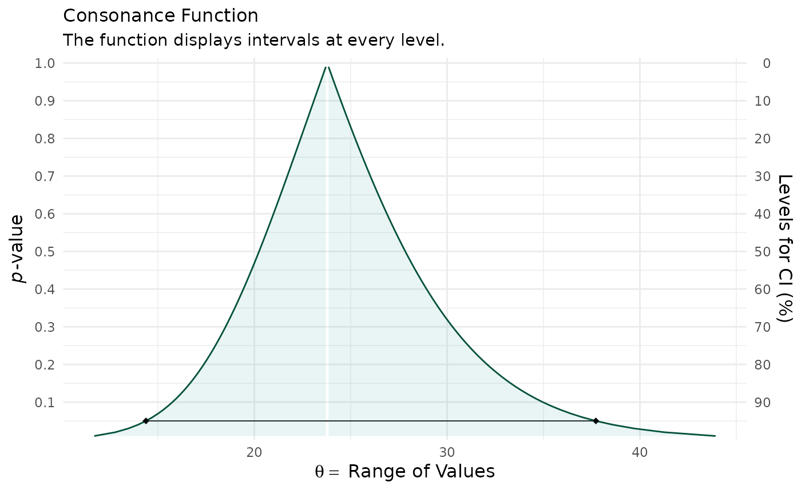
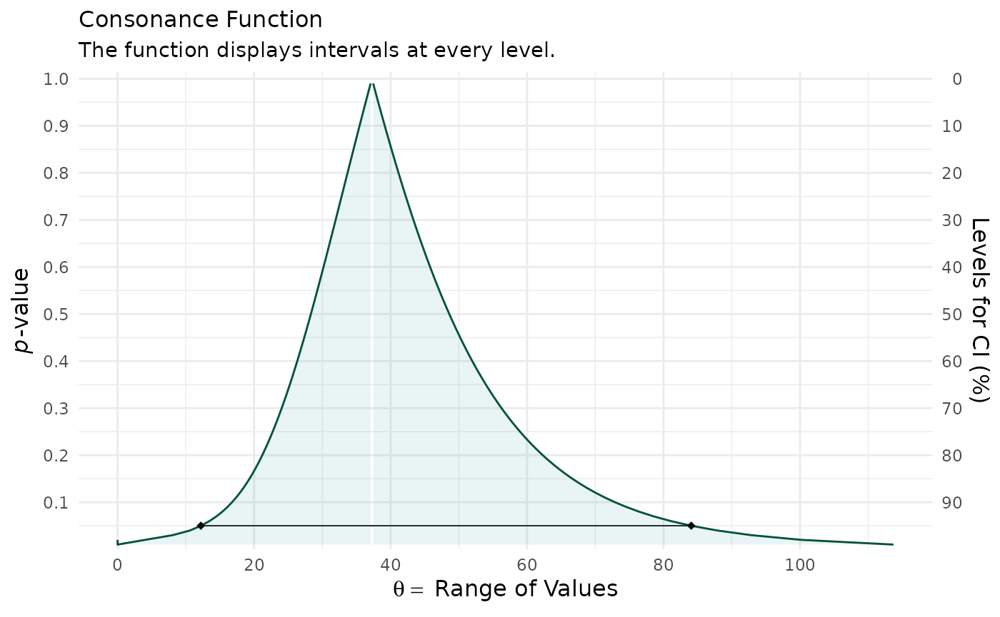
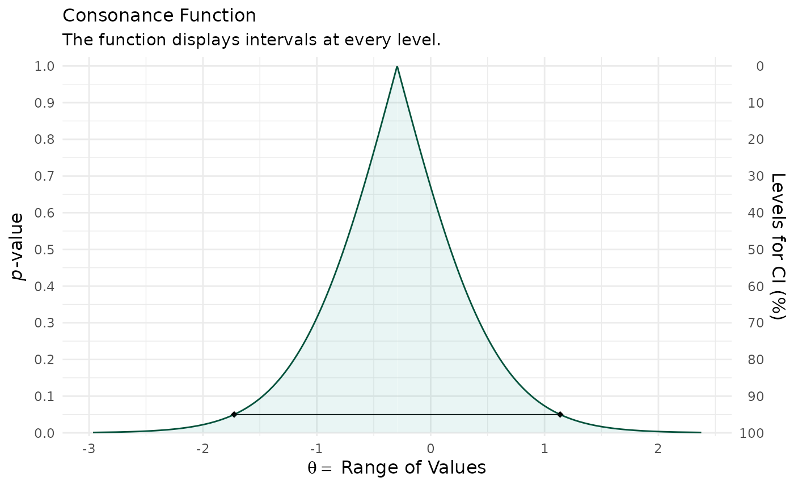

# Consonance Functions for Linear Mixed-Effects Models

Here is a simple example taken from the `lme4` documentation.

``` r

(confint.merMod(fm1 <- lmer(Reaction ~ Days + (Days | Subject), data = sleepstudy, REML = TRUE)))
#> Computing profile confidence intervals ...
#>                   2.5 %      97.5 %
#> .sig01       14.3813850  37.7158318
#> .sig02        3.8011641   8.7533831
#> .sig03       -0.4815008   0.6849863
#> .sigma       22.8982669  28.8579965
#> (Intercept) 237.6806955 265.1295147
#> Days          7.3586533  13.5759188
```

There’s our output. Now suppose that we wanted the to see the interval
estimates and functions of the variable “Days”, here’s how we would do
it with
[`curve_lmer()`](https://stat.lesslikely.com/concurve/reference/curve_lmer.md).
We use [`suppressMessages()`](https://rdrr.io/r/base/message.html) to
avoid seeing the long list of profiling messages.

``` r

library(concurve)
object1 <- suppressMessages(curve_lmer(object = fm1, parm = "Days", method = "profile", steps = 100))

sample1 <- suppressMessages(curve_lmer(object = fm1, parm = ".sig01", method = "profile", steps = 100))

ggcurve(data = sample1[[1]], type = "c", measure = "default")
#> Warning: Using `size` aesthetic for lines was deprecated in ggplot2 3.4.0.
#> ℹ Please use `linewidth` instead.
#> ℹ The deprecated feature was likely used in the concurve package.
#>   Please report the issue at <https://github.com/zadrafi/concurve/issues>.
#> This warning is displayed once per session.
#> Call `lifecycle::last_lifecycle_warnings()` to see where this warning was
#> generated.
```



Suppose we wanted to study the sources of variability in an experiment,
which could be used for descriptive purposes or to better understand the
sources so that they could be reduced in future experiment. This is
vital in areas like industrial quality control because if one cannot
take accurate measurements, then they have no hope of improving quality
control.

Here we look at an example presented by John Lawson presented by Davies
(1949).

> A dye manufacturer wanted to know if there was an appreciable
> contribution to variability in dyestuff color yields owing to the
> quality of the intermediate acid batch used. It was a two- step
> process. Intermediate acid batches were produced in one step, and in a
> later step the acid was used to produce the dyestuff. The goal was to
> keep dyestuff color yields consistently high. If the majority of
> variation was caused by differences among the intermediate acid
> batches, then improvement efforts should be concentrated on the
> process that makes the acid batches. If the majority of variation was
> within preparations of the dyestuff made from the same acid batch,
> improvement efforts should be focused on the process step of making
> the dyestuff. A sampling experiment was run wherein six representative
> samples of H acid intermediate were taken from the step manufacturing
> process that produces it. From each acid sample, five preparations of
> the dyestuff Naphthalene 12B were made in a laboratory, and these were
> representative of the preparations that could be made with each
> sample. The data from the sampling experiment is shown in Table 5.2.
> The yields are given in grams of standard color.

We wish to estimate the variance components from the collected data
above. A typical approach to estimate the variance components is to use
analysis of variance (first proposed by Fisher), which uses the method
of moments. However, in certain scenarios, this method is not desirable,
and the restricted maximum likelihood approach (REML) is preferable.

Here we show how to do that.

``` r

fm1M <- lmer( yield ~ 1 + (1| sample), data = Naph, REML = TRUE)

summary(fm1M)
#> Linear mixed model fit by REML ['lmerMod']
#> Formula: yield ~ 1 + (1 | sample)
#>    Data: Naph
#> 
#> REML criterion at convergence: 319.7
#> 
#> Scaled residuals: 
#>     Min      1Q  Median      3Q     Max 
#> -1.4117 -0.7634  0.1418  0.7792  1.8296 
#> 
#> Random effects:
#>  Groups   Name        Variance Std.Dev.
#>  sample   (Intercept) 1764     42.00   
#>  Residual             2451     49.51   
#> Number of obs: 30, groups:  sample, 6
#> 
#> Fixed effects:
#>             Estimate Std. Error t value
#> (Intercept)  1527.50      19.38    78.8
```

Now we attempt to estimate the interval estimates for variance
components.

``` r

sample2 <- suppressMessages(curve_lmer(object = fm1M, parm = ".sig01", method = "profile", steps = 100))

ggcurve(data = sample2[[1]], type = "c", measure = "default")
```



### Including Plots

You can also embed plots, for example:

``` r

c1 <- c( .5, -.5)

mod4 <- lmer( pl ~ 1 + Group + (1|Subject:Group) + Period + Treat, contrasts = list(Group = c1, Period = c1, Treat = c1), data = antifungal)

summary(mod4)
#> Linear mixed model fit by REML ['lmerMod']
#> Formula: pl ~ 1 + Group + (1 | Subject:Group) + Period + Treat
#>    Data: antifungal
#> 
#> REML criterion at convergence: 148.2
#> 
#> Scaled residuals: 
#>     Min      1Q  Median      3Q     Max 
#> -2.0564 -0.3291 -0.1490  0.5399  1.7021 
#> 
#> Random effects:
#>  Groups        Name        Variance Std.Dev.
#>  Subject:Group (Intercept) 1.508    1.228   
#>  Residual                  4.563    2.136   
#> Number of obs: 34, groups:  Subject:Group, 17
#> 
#> Fixed effects:
#>             Estimate Std. Error t value
#> (Intercept)  13.1687     0.4729  27.845
#> Group1        0.3375     0.9459   0.357
#> Period1      -0.2944     0.7340  -0.401
#> Treat1        0.5944     0.7340   0.810
#> 
#> Correlation of Fixed Effects:
#>         (Intr) Group1 Perid1
#> Group1  0.059               
#> Period1 0.000  0.000        
#> Treat1  0.000  0.000  0.059
```

``` r

crossed <- suppressMessages(curve_lmer(object = mod4, parm = "Period1", method = "profile"))

ggcurve(data = crossed[[1]], type = "c")
```



Note that the `echo = FALSE` parameter was added to the code chunk to
prevent printing of the R code that generated the plot.

## Session info

    #> R version 4.6.1 (2026-06-24)
    #> Platform: x86_64-pc-linux-gnu
    #> Running under: Ubuntu 24.04.4 LTS
    #> 
    #> Matrix products: default
    #> BLAS:   /usr/lib/x86_64-linux-gnu/openblas-pthread/libblas.so.3 
    #> LAPACK: /usr/lib/x86_64-linux-gnu/openblas-pthread/libopenblasp-r0.3.26.so;  LAPACK version 3.12.0
    #> 
    #> locale:
    #>  [1] LC_CTYPE=C.UTF-8       LC_NUMERIC=C           LC_TIME=C.UTF-8       
    #>  [4] LC_COLLATE=C.UTF-8     LC_MONETARY=C.UTF-8    LC_MESSAGES=C.UTF-8   
    #>  [7] LC_PAPER=C.UTF-8       LC_NAME=C              LC_ADDRESS=C          
    #> [10] LC_TELEPHONE=C         LC_MEASUREMENT=C.UTF-8 LC_IDENTIFICATION=C   
    #> 
    #> time zone: UTC
    #> tzcode source: system (glibc)
    #> 
    #> attached base packages:
    #> [1] stats     graphics  grDevices utils     datasets  methods   base     
    #> 
    #> other attached packages:
    #> [1] daewr_1.2-11   lme4_2.0-6     Matrix_1.7-5   concurve_3.0.0
    #> 
    #> loaded via a namespace (and not attached):
    #>  [1] sass_0.4.10        generics_0.1.4     tidyr_1.3.2        lattice_0.22-9    
    #>  [5] digest_0.6.39      magrittr_2.0.5     evaluate_1.0.5     grid_4.6.1        
    #>  [9] RColorBrewer_1.1-3 fastmap_1.2.0      jsonlite_2.0.0     purrr_1.2.2       
    #> [13] scales_1.4.0       textshaping_1.0.5  jquerylib_0.1.4    reformulas_0.4.4  
    #> [17] Rdpack_2.6.6       cli_3.6.6          rlang_1.3.0        rbibutils_2.4.1   
    #> [21] splines_4.6.1      withr_3.0.3        cachem_1.1.0       yaml_2.3.12       
    #> [25] otel_0.2.0         parallel_4.6.1     tools_4.6.1        nloptr_2.2.1      
    #> [29] minqa_1.2.8        dplyr_1.2.1        colorspace_2.1-3   ggplot2_4.0.3     
    #> [33] boot_1.3-32        vctrs_0.7.3        R6_2.6.1           lifecycle_1.0.5   
    #> [37] fs_2.1.0           htmlwidgets_1.6.4  MASS_7.3-65        ragg_1.5.2        
    #> [41] pkgconfig_2.0.3    desc_1.4.3         pkgdown_2.2.1      pillar_1.11.1     
    #> [45] bslib_0.12.0       gtable_0.3.6       Rcpp_1.1.2         glue_1.8.1        
    #> [49] systemfonts_1.3.2  xfun_0.60          tibble_3.3.1       tidyselect_1.2.1  
    #> [53] knitr_1.51         farver_2.1.2       htmltools_0.5.9    nlme_3.1-169      
    #> [57] rmarkdown_2.31     compiler_4.6.1     S7_0.2.2

------------------------------------------------------------------------

## References

------------------------------------------------------------------------
