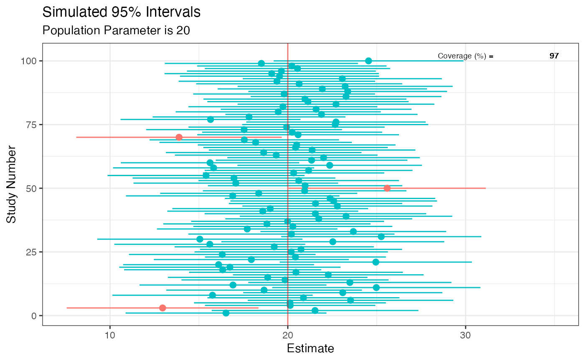
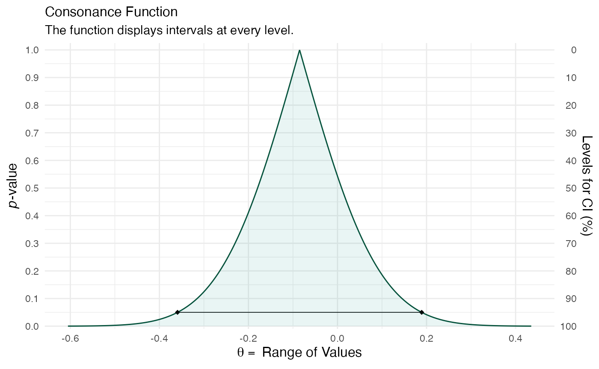
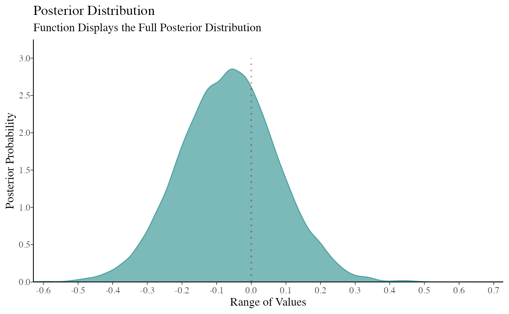
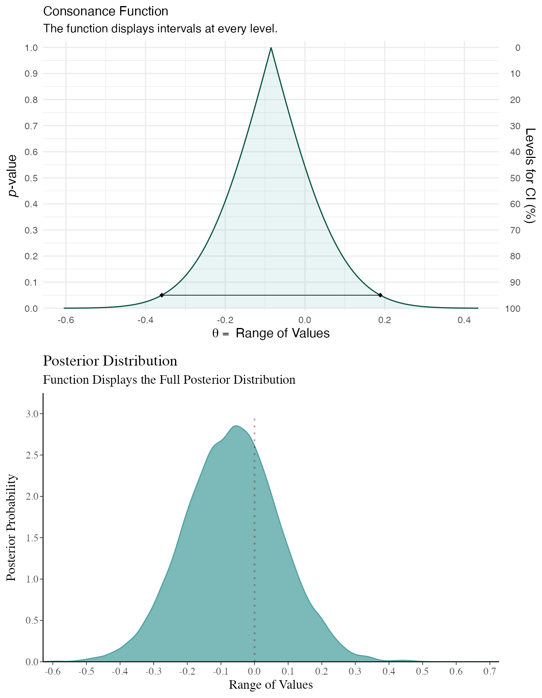
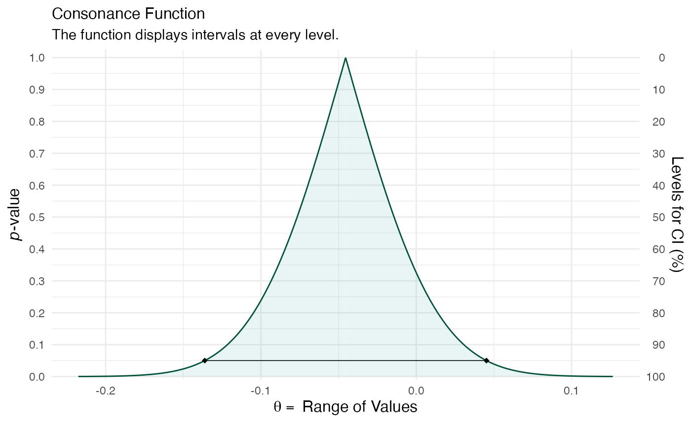
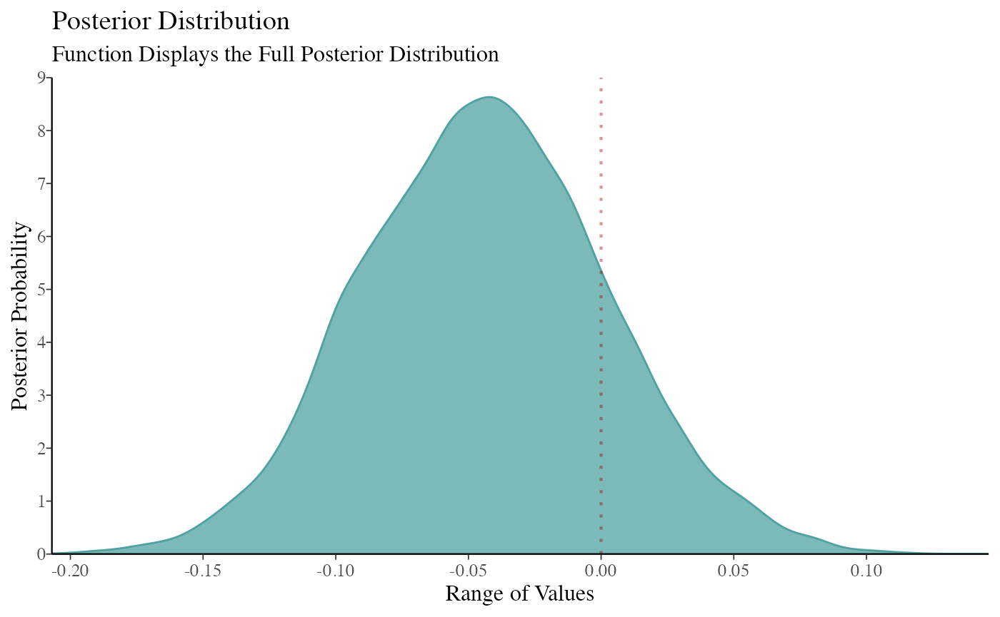
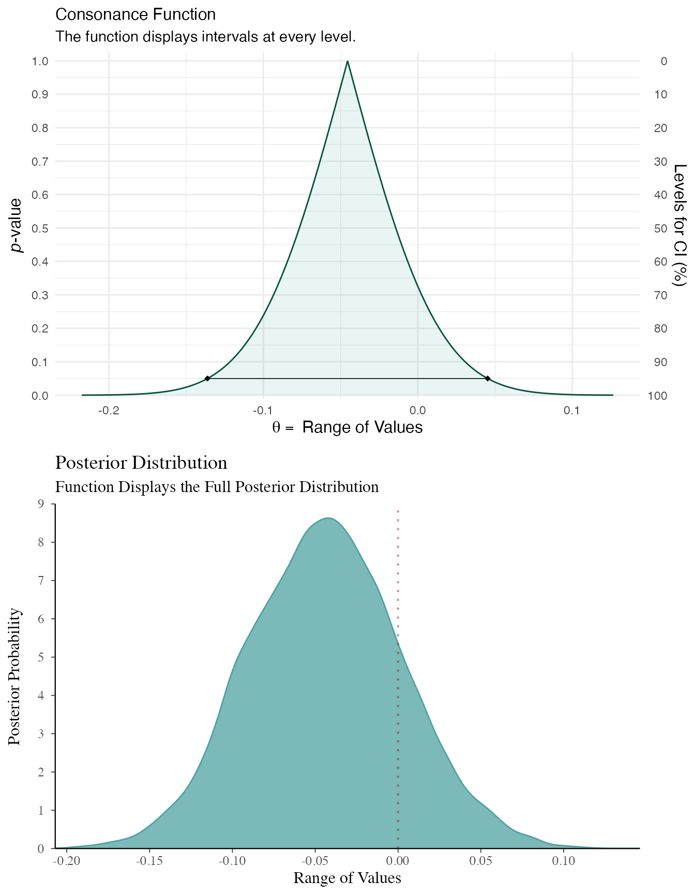
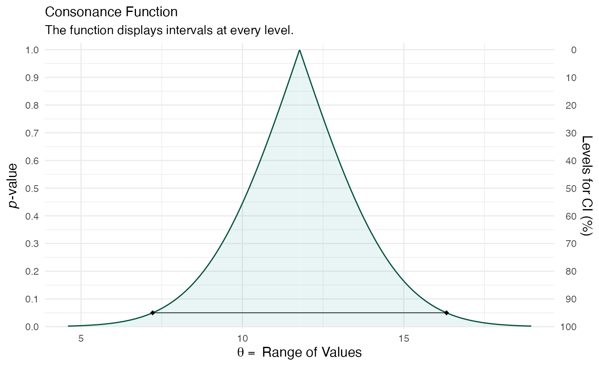
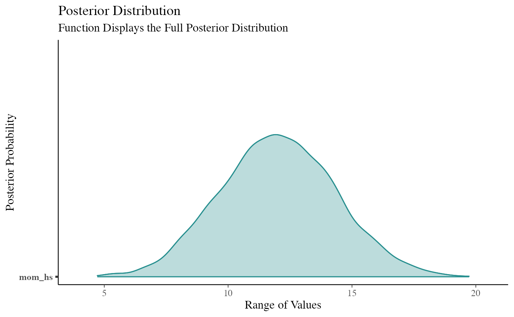
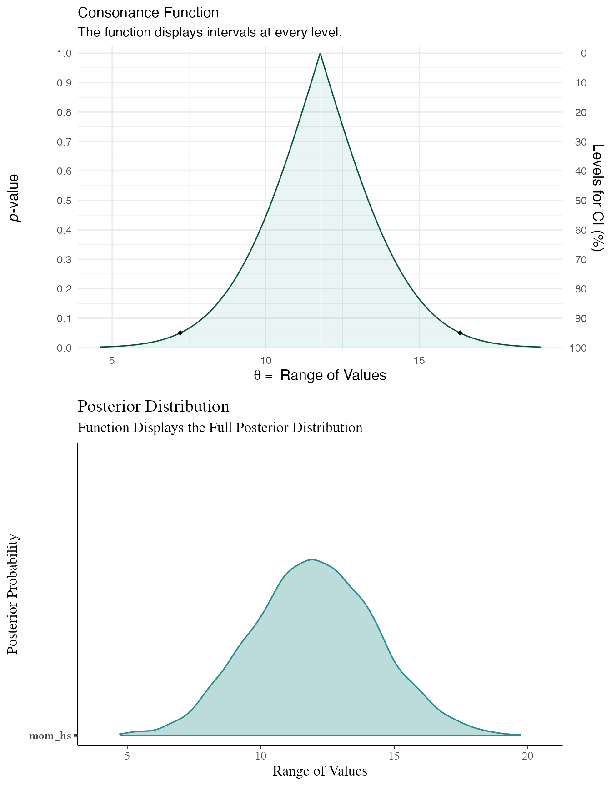

# Comparison to Bayesian Posterior Distributions

Unlike Bayesian posterior distributions, confidence/consonance functions
do not have any distributional properties and also lack the
interpretation that should be given to Bayesian posterior intervals. For
example, a Bayesian 95% posterior interval has the proper interpretation
of having a 95% probability of containing the true value.

This does not apply to 95% frequentist intervals, where the 95% refers
to the long run coverage of these intervals containing the true
parameter if the study were repeated over and over. Thus, either a 95%
frequentist interval contains the true parameter or it does not. In the
code below, we simulate some data where the true population parameter is
20 and we know this because we’re the deities of this world. A properly
behaving statistical procedure with a set alpha of 0.05 will yield *at
least* 95% intervals in the long run that will include this population
parameter of 20. Those that do not are marked in red.

``` r

sim <- function() {
  fake <- data.frame((x <- rnorm(100, 100, 20)), (y <- rnorm(100, 80, 20)))
  intervals <- t.test(x = x, y = y, data = fake, conf.level = .95)$conf.int[]
}

set.seed(1031)

z <- replicate(100, sim(), simplify = FALSE)

df <- data.frame(do.call(rbind, z))
df$studynumber <- (1:length(z))
intrvl.limit <- c("lower.limit", "upper.limit", "studynumber")
colnames(df) <- intrvl.limit
df$point <- ((df$lower.limit + df$upper.limit) / 2)
df$covered <- (df$lower.limit <= 20 & 20 <= df$upper.limit)
df$coverageprob <- ((as.numeric(table(df$covered)[2]) / nrow(df) * 100))

library(ggplot2)


ggplot(data = df, aes(x = studynumber, y = point, ymin = lower.limit, ymax = upper.limit)) +
  geom_pointrange(mapping = aes(color = covered), size = .40) +
  geom_hline(yintercept = 20, lty = 1, color = "red", alpha = 0.5) +
  coord_flip() +
  labs(
    title = "Simulated 95% Intervals",
    x = "Study Number",
    y = "Estimate",
    subtitle = "Population Parameter is 20"
  ) +
  theme_bw() + # use a white background
  theme(legend.position = "none") +
  annotate(
    geom = "text", x = 102, y = 30,
    label = "Coverage (%) =", size = 2.5, color = "black"
  ) +
  annotate(
    geom = "text", x = 102, y = 35,
    label = df$coverageprob, size = 2.5, color = "black"
  )
```



Although the code above demonstrates this, one of the best visualization
tools to understand this long-run behavior is the D3.js visualization
created by Kristoffer Magnusson, which [can be viewed
here](https://rpsychologist.com/d3/CI/).

However, despite these differences in interpretation, Bayesian and
frequentist intervals often end up converging, especially when there are
large amounts of data. They also end up converging when a Bayesian
posterior distribution is computed with a flat or weakly informative
prior. However, there are several problems with using flat priors, such
as giving equal weight to all values in the interval including
implausible ones. These sorts of priors should generally be avoided.
However, for the sake of this demonstration, we will be using flat
priors.

Here, I demonstrate with a simple example how Bayesian posterior
distributions and frequentist confidence functions end up converging in
some scenarios. For these first few examples, I’ll be using the
`rstanarm` package.^([1](#ref-goodrichRstanarmBayesianApplied2020))

``` r

library(concurve)
#> Please see the documentation on https://data.lesslikely.com/concurve/ or by typing `help(concurve)`
library(rstan)
#> Loading required package: StanHeaders
#> 
#> rstan version 2.32.7 (Stan version 2.32.2)
#> For execution on a local, multicore CPU with excess RAM we recommend calling
#> options(mc.cores = parallel::detectCores()).
#> To avoid recompilation of unchanged Stan programs, we recommend calling
#> rstan_options(auto_write = TRUE)
#> For within-chain threading using `reduce_sum()` or `map_rect()` Stan functions,
#> change `threads_per_chain` option:
#> rstan_options(threads_per_chain = 1)
library(rstanarm)
#> Loading required package: Rcpp
#> This is rstanarm version 2.32.2
#> - See https://mc-stan.org/rstanarm/articles/priors for changes to default priors!
#> - Default priors may change, so it's safest to specify priors, even if equivalent to the defaults.
#> - For execution on a local, multicore CPU with excess RAM we recommend calling
#>   options(mc.cores = parallel::detectCores())
#> 
#> Attaching package: 'rstanarm'
#> The following object is masked from 'package:rstan':
#> 
#>     loo
library(ggplot2)
library(cowplot)
library(bayesplot)
#> This is bayesplot version 1.15.0
#> - Online documentation and vignettes at mc-stan.org/bayesplot
#> - bayesplot theme set to bayesplot::theme_default()
#>    * Does _not_ affect other ggplot2 plots
#>    * See ?bayesplot_theme_set for details on theme setting
library(scales)
```

We will simulate some data (two variables) from a normal distribution
with a location parameter of 0 and scale parameter of 1 (something very
simple) and then regress the second variables (GroupB) on the first
using the base lm function. We will take the regression coefficient and
construct a consonance function for it.

``` r

GroupA <- rnorm(50)
GroupB <- rnorm(50)
RandomData <- data.frame(GroupA, GroupB)
model_freq <- lm(GroupA ~ GroupB, data = RandomData)
```

Now we will do the same using Bayesian methods, but instead of
specifying a prior, we will use a flat prior to show the convergence of
the posterior with the consonance function.

``` r

rstan_options(auto_write = TRUE)

# Using flat prior
model_bayes <- stan_lm(GroupA ~ GroupB,
  data = RandomData, prior = NULL,
  iter = 5000, warmup = 1000, chains = 4
)
```

Now that we’ve fit the models, we can graph the functions.

``` r

randomframe <- curve_gen(model_freq, "GroupB", steps = 10000)

(function1 <- ggcurve(type = "c", randomframe[[1]], nullvalue = TRUE))
#> Warning: Using `size` aesthetic for lines was deprecated in ggplot2 3.4.0.
#> ℹ Please use `linewidth` instead.
#> ℹ The deprecated feature was likely used in the concurve package.
#>   Please report the issue at <https://github.com/zadrafi/concurve/issues>.
#> This warning is displayed once per session.
#> Call `lifecycle::last_lifecycle_warnings()` to see where this warning was
#> generated.
```



``` r


color_scheme_set("teal")

function2 <- mcmc_dens(model_bayes, pars = "GroupB") +
  ggtitle("Posterior Distribution") +
  labs(subtitle = "Function Displays the Full Posterior Distribution", x = "Range of Values", y = "Posterior Probability") +
  scale_y_continuous(breaks = c(0, 0.30, 0.60, 0.90, 1.20, 1.50, 1.80, 2.10, 2.40, 2.70, 3.0))
#> Scale for y is already present.
#> Adding another scale for y, which will replace the existing scale.


(breaks1 <- c(0, 0.30, 0.60, 0.90, 1.20, 1.50, 1.80, 2.10, 2.40, 2.70, 3.0))
#>  [1] 0.0 0.3 0.6 0.9 1.2 1.5 1.8 2.1 2.4 2.7 3.0

(adjustment <- function(x) {
  x / 3
})
#> function (x) 
#> {
#>     x/3
#> }

(labels <- adjustment(breaks1))
#>  [1] 0.0 0.1 0.2 0.3 0.4 0.5 0.6 0.7 0.8 0.9 1.0

breaks <- labels
labels1 <- labels

(function3 <- mcmc_dens(model_bayes, pars = "GroupB") +
  ggtitle("Posterior Distribution") +
  labs(subtitle = "Function Displays the Full Posterior Distribution", x = "Range of Values", y = "Posterior Probability") +
  scale_x_continuous(expand = c(0, 0), breaks = scales::pretty_breaks(n = 10)) +
  scale_y_continuous(expand = c(0, 0), breaks = waiver(), labels = waiver(), n.breaks = 10, limits = c(0, 3.25)) +
  yaxis_text(on = TRUE) +
  yaxis_ticks(on = TRUE) +
  annotate("segment",
    x = 0, xend = 0, y = 0, yend = 3,
    color = "#990000", alpha = 0.4, size = .75, linetype = 3
  ))
#> Scale for x is already present.
#> Adding another scale for x, which will replace the existing scale.
#> Scale for y is already present.
#> Adding another scale for y, which will replace the existing scale.
```



I made some adjustments above to the bayesplot code so that we could
more easily compare the consonance distribution to the posterior
distribution. We will be using plot_grid() from cowplot to achieve this.

``` r

plot_grid(function1, function3, ncol = 1, align = "v")
```



As you can see, the results end up being very similar. You can likely
get very similar results with weakly informative priors normal(0, 100)
or with much larger datasets, where the likelihood will end up swamping
the prior, though this isn’t always the case.

Here’s another example, but this time the variables we simulate have
different location parameters.

``` r


GroupA <- rnorm(500, mean = 2)
GroupB <- rnorm(500, mean = 1)
RandomData <- data.frame(GroupA, GroupB)
model_freq <- lm(GroupA ~ GroupB, data = RandomData)
```

``` r


# Using flat prior
model_bayes <- stan_lm(GroupA ~ GroupB,
  data = RandomData, prior = NULL,
  iter = 5000, warmup = 1000, chains = 4
)
```

``` r


randomframe <- curve_gen(model_freq, "GroupB", steps = 10000)

(function1 <- ggcurve(type = "c", randomframe[[1]], nullvalue = TRUE))
```



``` r


color_scheme_set("teal")

function2 <- mcmc_dens(model_bayes, pars = "GroupB") +
  ggtitle("Posterior Distribution") +
  labs(subtitle = "Function Displays the Full Posterior Distribution", x = "Range of Values", y = "Posterior Probability") +
  scale_y_continuous(breaks = c(0, 0.30, 0.60, 0.90, 1.20, 1.50, 1.80, 2.10, 2.40, 2.70, 3.0))
#> Scale for y is already present.
#> Adding another scale for y, which will replace the existing scale.


(breaks1 <- c(0, 0.30, 0.60, 0.90, 1.20, 1.50, 1.80, 2.10, 2.40, 2.70, 3.0))
#>  [1] 0.0 0.3 0.6 0.9 1.2 1.5 1.8 2.1 2.4 2.7 3.0

(adjustment <- function(x) {
  x / 3
})
#> function (x) 
#> {
#>     x/3
#> }

(labels <- adjustment(breaks1))
#>  [1] 0.0 0.1 0.2 0.3 0.4 0.5 0.6 0.7 0.8 0.9 1.0

breaks <- labels
labels1 <- labels

(function3 <- mcmc_dens(model_bayes, pars = "GroupB") +
  ggtitle("Posterior Distribution") +
  labs(subtitle = "Function Displays the Full Posterior Distribution", x = "Range of Values", y = "Posterior Probability") +
  scale_x_continuous(expand = c(0, 0), breaks = scales::pretty_breaks(n = 10)) +
  scale_y_continuous(expand = c(0, 0), breaks = waiver(), labels = waiver(), n.breaks = 10, limits = c(0, 9)) +
  yaxis_text(on = TRUE) +
  yaxis_ticks(on = TRUE) +
  annotate("segment",
    x = 0, xend = 0, y = 0, yend = 9,
    color = "#990000", alpha = 0.4, size = .75, linetype = 3
  ))
#> Scale for x is already present.
#> Adding another scale for x, which will replace the existing scale.
#> Scale for y is already present.
#> Adding another scale for y, which will replace the existing scale.
```



``` r

plot_grid(function1, function3, ncol = 1, align = "v")
```



Here’s another dataset, however, here we’re not generating random
numbers.

``` r


data(kidiq)

# flat prior

post1 <- stan_lm(kid_score ~ mom_hs,
  data = kidiq, prior = NULL,
  seed = 12345
)
```

``` r

post2 <- lm(kid_score ~ mom_hs, data = kidiq)

df3 <- curve_gen(post2, "mom_hs")

(function99 <- ggcurve(df3[[1]]))
```



``` r


summary(post1)
#> 
#> Model Info:
#>  function:     stan_lm
#>  family:       gaussian [identity]
#>  formula:      kid_score ~ mom_hs
#>  algorithm:    sampling
#>  sample:       4000 (posterior sample size)
#>  priors:       see help('prior_summary')
#>  observations: 434
#>  predictors:   2
#> 
#> Estimates:
#>                 mean   sd   10%   50%   90%
#> (Intercept)   77.3    2.1 74.7  77.4  80.0 
#> mom_hs        12.0    2.3  9.0  12.0  15.0 
#> sigma         19.8    0.7 19.0  19.8  20.7 
#> log-fit_ratio -0.2    0.0 -0.2  -0.2  -0.1 
#> R2             0.1    0.0  0.0   0.1   0.1 
#> 
#> Fit Diagnostics:
#>            mean   sd   10%   50%   90%
#> mean_PPD 86.8    1.3 85.1  86.8  88.4 
#> 
#> The mean_ppd is the sample average posterior predictive distribution of the outcome variable (for details see help('summary.stanreg')).
#> 
#> MCMC diagnostics
#>               mcse Rhat n_eff
#> (Intercept)   0.1  1.0   873 
#> mom_hs        0.1  1.0   931 
#> sigma         0.0  1.0  1724 
#> log-fit_ratio 0.0  1.0  1072 
#> R2            0.0  1.0   833 
#> mean_PPD      0.0  1.0  3745 
#> log-posterior 0.0  1.0  1338 
#> 
#> For each parameter, mcse is Monte Carlo standard error, n_eff is a crude measure of effective sample size, and Rhat is the potential scale reduction factor on split chains (at convergence Rhat=1).

color_scheme_set("teal")

(function101 <- mcmc_areas(post1, pars = "mom_hs", point_est = "none", prob = 1, prob_outer = 1, area_method = "equal height") +
  ggtitle("Posterior Distribution") +
  labs(subtitle = "Function Displays the Full Posterior Distribution", x = "Range of Values", y = "Posterior Probability") +
  yaxis_text(on = TRUE) +
  yaxis_ticks(on = TRUE))
```



``` r

cowplot::plot_grid(function99, function101, ncol = 1, align = "v")
```



## Cite R Packages

Please remember to cite the packages that you use.

``` r

citation("concurve")
#> To cite package 'concurve' in publications use:
#> 
#>   Rafi Z, Vigotsky A (2026). _concurve: Computes and Plots
#>   Compatibility (Confidence) Intervals, P-Values, S-Values, &
#>   Likelihood Intervals to Form Consonance, Surprisal, & Likelihood
#>   Functions_. R package version 3.0.0,
#>   <https://CRAN.R-project.org/package=concurve>.
#> 
#>   Rafi Z, Greenland S (2020). "Semantic and Cognitive Tools to Aid
#>   Statistical Science: Replace Confidence and Significance by
#>   Compatibility and Surprise." _BMC Medical Research Methodology_,
#>   *20*, 244. ISSN 1471-2288, doi:10.1186/s12874-020-01105-9
#>   <https://doi.org/10.1186/s12874-020-01105-9>,
#>   <https://doi.org/10.1186/s12874-020-01105-9>.
#> 
#> To see these entries in BibTeX format, use 'print(<citation>,
#> bibtex=TRUE)', 'toBibtex(.)', or set
#> 'options(citation.bibtex.max=999)'.
citation("ggplot2")
#> To cite ggplot2 in publications, please use
#> 
#>   H. Wickham. ggplot2: Elegant Graphics for Data Analysis.
#>   Springer-Verlag New York, 2016.
#> 
#> A BibTeX entry for LaTeX users is
#> 
#>   @Book{,
#>     author = {Hadley Wickham},
#>     title = {ggplot2: Elegant Graphics for Data Analysis},
#>     publisher = {Springer-Verlag New York},
#>     year = {2016},
#>     isbn = {978-3-319-24277-4},
#>     url = {https://ggplot2.tidyverse.org},
#>   }
citation("rstan")
#> To cite RStan in publications use:
#> 
#>   Stan Development Team (2025). RStan: the R interface to Stan. R
#>   package version 2.32.7. https://mc-stan.org/.
#> 
#> A BibTeX entry for LaTeX users is
#> 
#>   @Misc{,
#>     title = {{RStan}: the {R} interface to {Stan}},
#>     author = {{Stan Development Team}},
#>     note = {R package version 2.32.7},
#>     year = {2025},
#>     url = {https://mc-stan.org/},
#>   }
citation("rstanarm")
#> To cite rstanarm in publications please use the first citation entry.
#> If you were using the 'stan_jm' modelling function then, where
#> possible, please consider including the second citation entry as well.
#> 
#>   Goodrich B, Gabry J, Ali I & Brilleman S. (2025). rstanarm: Bayesian
#>   applied regression modeling via Stan. R package version 2.32.2
#>   https://mc-stan.org/rstanarm.
#> 
#>   Brilleman SL, Crowther MJ, Moreno-Betancur M, Buros Novik J & Wolfe
#>   R. Joint longitudinal and time-to-event models via Stan. StanCon
#>   2018. 10-12 Jan 2018. Pacific Grove, CA, USA.
#>   https://github.com/stan-dev/stancon_talks/
#> 
#> To see these entries in BibTeX format, use 'print(<citation>,
#> bibtex=TRUE)', 'toBibtex(.)', or set
#> 'options(citation.bibtex.max=999)'.
citation("cowplot")
#> To cite package 'cowplot' in publications use:
#> 
#>   Wilke C (2025). _cowplot: Streamlined Plot Theme and Plot Annotations
#>   for 'ggplot2'_. doi:10.32614/CRAN.package.cowplot
#>   <https://doi.org/10.32614/CRAN.package.cowplot>, R package version
#>   1.2.0, <https://CRAN.R-project.org/package=cowplot>.
#> 
#> A BibTeX entry for LaTeX users is
#> 
#>   @Manual{,
#>     title = {cowplot: Streamlined Plot Theme and Plot Annotations for 'ggplot2'},
#>     author = {Claus O. Wilke},
#>     year = {2025},
#>     note = {R package version 1.2.0},
#>     url = {https://CRAN.R-project.org/package=cowplot},
#>     doi = {10.32614/CRAN.package.cowplot},
#>   }
citation("scales")
#> To cite package 'scales' in publications use:
#> 
#>   Wickham H, Pedersen T, Seidel D (2025). _scales: Scale Functions for
#>   Visualization_. doi:10.32614/CRAN.package.scales
#>   <https://doi.org/10.32614/CRAN.package.scales>, R package version
#>   1.4.0, <https://CRAN.R-project.org/package=scales>.
#> 
#> A BibTeX entry for LaTeX users is
#> 
#>   @Manual{,
#>     title = {scales: Scale Functions for Visualization},
#>     author = {Hadley Wickham and Thomas Lin Pedersen and Dana Seidel},
#>     year = {2025},
#>     note = {R package version 1.4.0},
#>     url = {https://CRAN.R-project.org/package=scales},
#>     doi = {10.32614/CRAN.package.scales},
#>   }
citation("bayesplot")
#> To cite the bayesplot R package:
#> 
#>   Gabry J, Mahr T (2025). "bayesplot: Plotting for Bayesian Models." R
#>   package version 1.15.0, <https://mc-stan.org/bayesplot/>.
#> 
#> To cite the bayesplot paper 'Visualization in Bayesian workflow':
#> 
#>   Gabry J, Simpson D, Vehtari A, Betancourt M, Gelman A (2019).
#>   "Visualization in Bayesian workflow." _J. R. Stat. Soc. A_, *182*,
#>   389-402. doi:10.1111/rssa.12378 <https://doi.org/10.1111/rssa.12378>.
#> 
#> To see these entries in BibTeX format, use 'print(<citation>,
#> bibtex=TRUE)', 'toBibtex(.)', or set
#> 'options(citation.bibtex.max=999)'.
```

## References

------------------------------------------------------------------------

1\.

Goodrich B, Gabry J, Ali I, Brilleman S. Rstanarm: Bayesian applied
regression modeling via Stan. 2020.
[https://mc-stan.org/rstanarm.](https://mc-stan.org/rstanarm)
