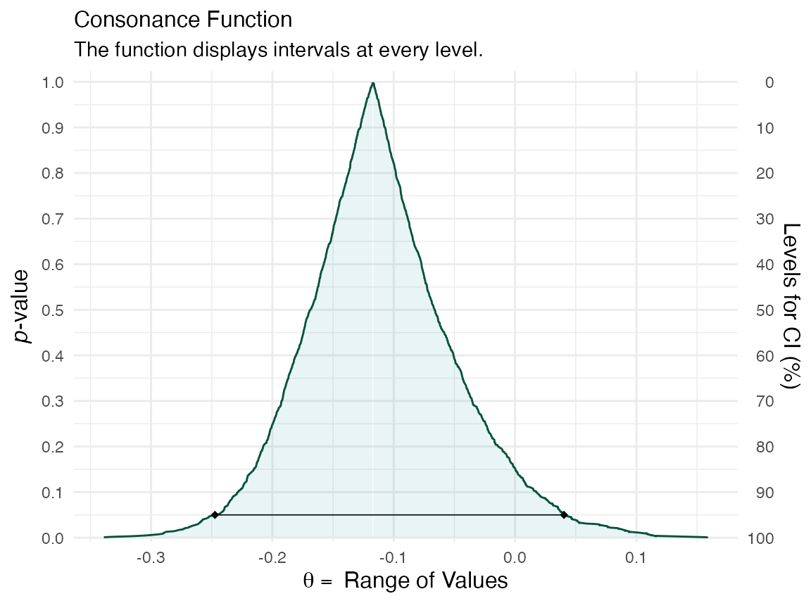
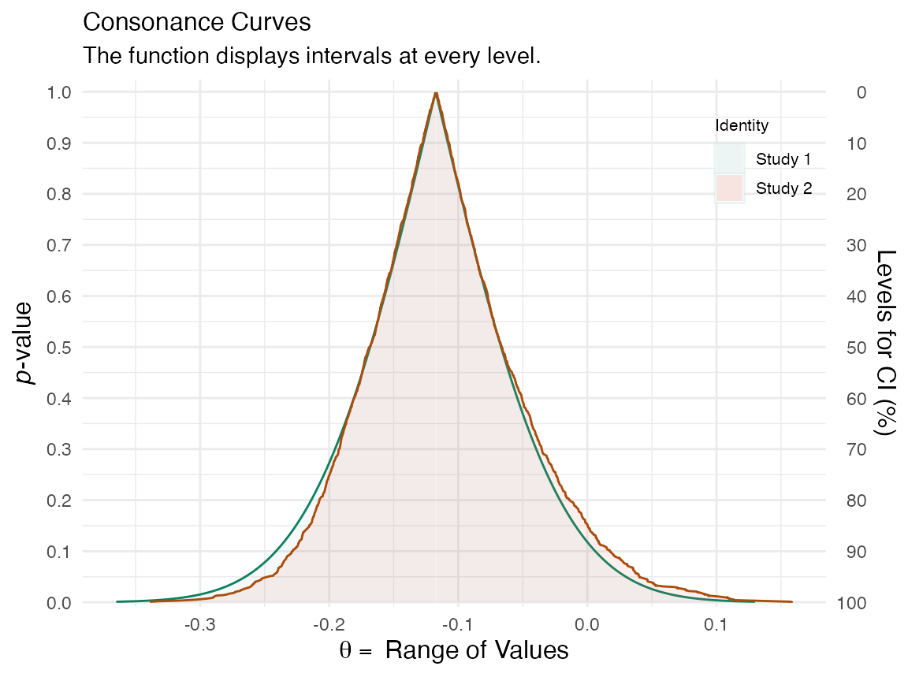
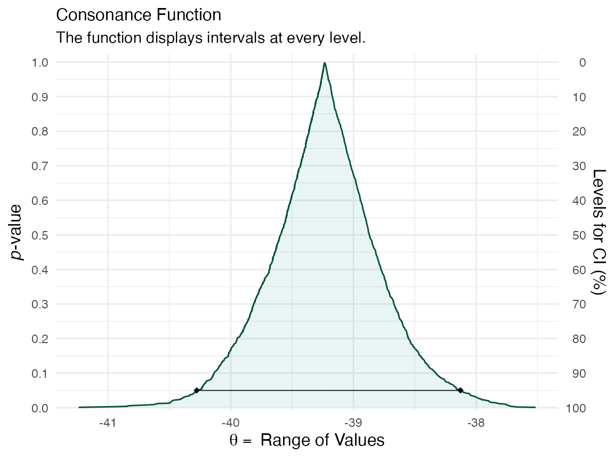
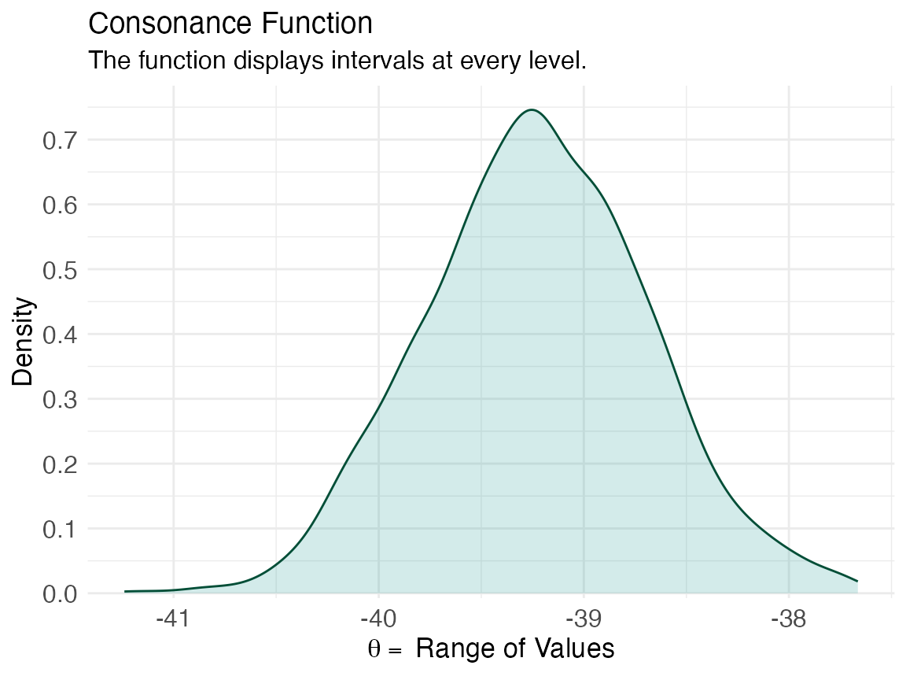
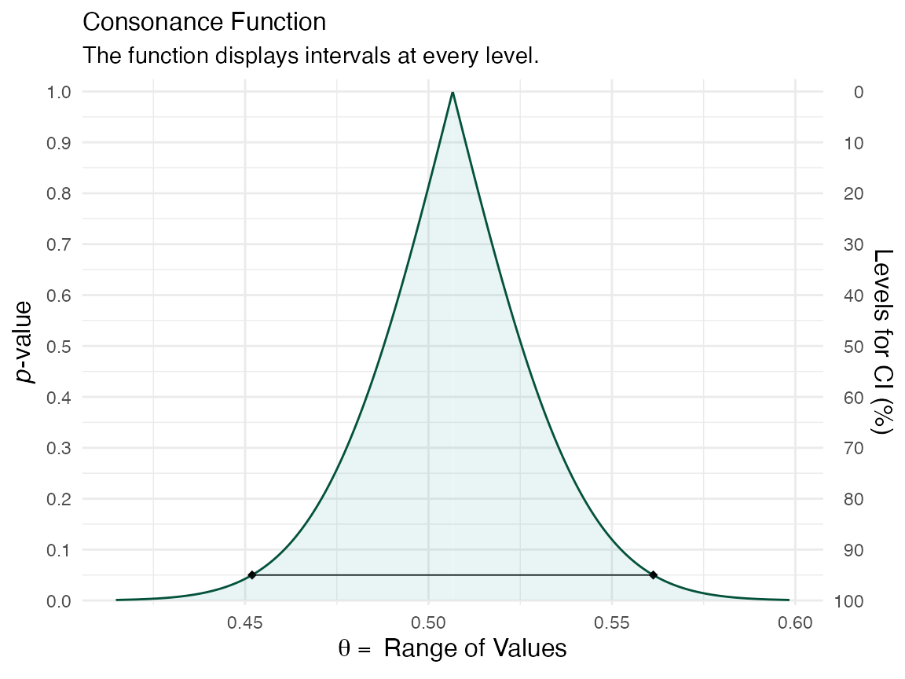
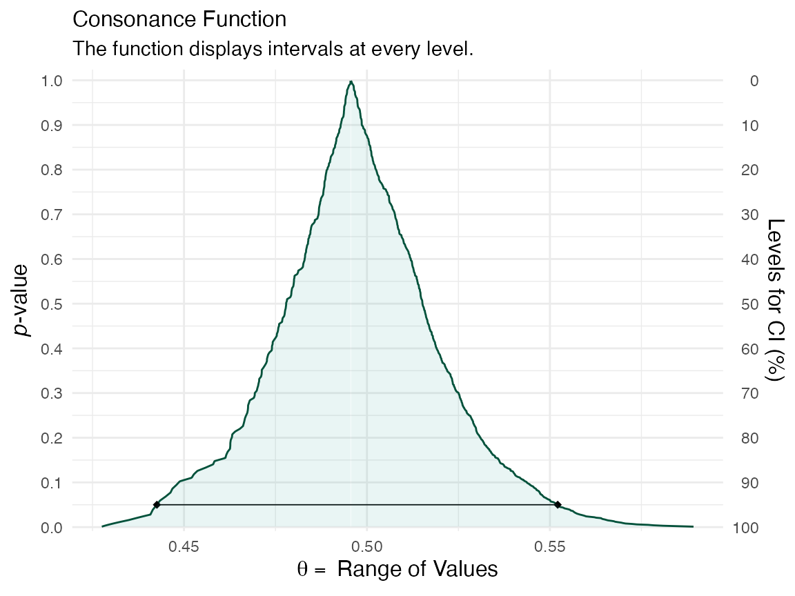
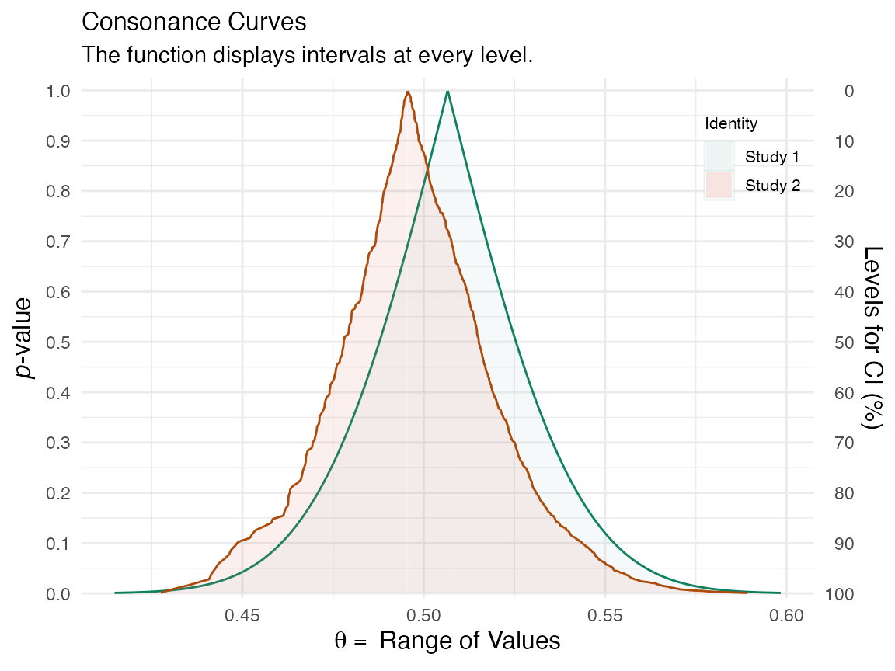

# The Bootstrap and Consonance Functions

Some authors have shown that the bootstrap distribution is equal to the
confidence distribution because it meets the definition of a consonance
distribution.^([1](#ref-efronFisher21stCentury1998)–[3](#ref-xieConfidenceDistributionFrequentist2013))
The bootstrap distribution and the asymptotic consonance distribution
would be defined as:

``` math
H_{n}(\theta)=1-P\left(\hat{\theta}-\hat{\theta}^{*} \leq \hat{\theta}-\theta | \mathbf{x}\right)=P\left(\hat{\theta}^{*} \leq \theta | \mathbf{x}\right)
```

Certain bootstrap methods such as the `BCa` method and `t`-bootstrap
method also yield second order accuracy of consonance distributions.

``` math
H_{n}(\theta)=1-P\left(\frac{\hat{\theta}^{*}-\hat{\theta}}{\widehat{S E}^{*}\left(\hat{\theta}^{*}\right)} \leq \frac{\hat{\theta}-\theta}{\widehat{S E}(\hat{\theta})} | \mathbf{x}\right)
```

Here, I demonstrate how to use these particular bootstrap methods to
arrive at consonance curves and densities.

We’ll use the `Iris` dataset and construct a function that’ll yield a
parameter of interest.

### The Nonparametric Bootstrap

``` r

iris <- datasets::iris
foo <- function(data, indices) {
  dt <- data[indices, ]
  c(
    cor(dt[, 1], dt[, 2], method = "p")
  )
}
```

We can now use the [`curve_boot()`](reference/curve_boot.md) method to
construct a function. The default method used for this function is the
“`Bca`” method provided by the
[`bcaboot`](https://cran.r-project.org/package=bcaboot)
package.^([**efron2018?**](#ref-efron2018))

I will suppress the output of the function because it is unnecessarily
long. But we’ve placed all the estimates into a list object called y.

The first item in the list will be the consonance distribution
constructed by typical means, while the third item will be the bootstrap
approximation to the consonance distribution.

``` r

ggcurve(data = y[[1]], nullvalue = TRUE)
#> Warning: Using `size` aesthetic for lines was deprecated in ggplot2 3.4.0.
#> ℹ Please use `linewidth` instead.
#> ℹ The deprecated feature was likely used in the concurve package.
#>   Please report the issue at <https://github.com/zadrafi/concurve/issues>.
#> This warning is displayed once per session.
#> Call `lifecycle::last_lifecycle_warnings()` to see where this warning was
#> generated.
```


``` r

ggcurve(data = y[[3]], nullvalue = TRUE)
```



We can also print out a table for TeX documents

``` r

(gg <- curve_table(data = y[[1]], format = "image"))
```

| Lower Limit | Upper Limit | Interval Width | Interval Level (%) | CDF | P-value | S-value (bits) |
|----|----|----|----|----|----|----|
| -0.142 | -0.094 | 0.048 | 25 | 0.625 | 0.75 | 0.415 |
| -0.168 | -0.067 | 0.101 | 50 | 0.750 | 0.50 | 1.000 |
| -0.204 | -0.031 | 0.173 | 75 | 0.875 | 0.25 | 2.000 |
| -0.214 | -0.021 | 0.193 | 80 | 0.900 | 0.20 | 2.322 |
| -0.265 | 0.030 | 0.295 | 95 | 0.975 | 0.05 | 4.322 |
| -0.311 | 0.076 | 0.387 | 99 | 0.995 | 0.01 | 6.644 |

More bootstrap replications will lead to a smoother function. But for
now, we can compare these two functions to see how similar they are.

``` r

plot_compare(y[[1]], y[[3]])
```



If we wanted to look at the bootstrap standard errors, we could do so by
loading the fifth item in the list

``` r

knitr::kable(y[[5]])
```

|     |      theta |    sdboot |        z0 |         a |   sdjack |
|:----|-----------:|----------:|----------:|----------:|---------:|
| est | -0.1175698 | 0.0751695 | 0.0062666 | 0.0304863 | 0.075694 |
| jsd |  0.0000000 | 0.0011226 | 0.0285413 | 0.0000000 | 0.000000 |

where in the top row, `theta` is the point estimate, and `sdboot` is the
bootstrap estimate of the standard error, `sdjack` is the jacknife
estimate of the standard error. `z0` is the bias correction value and
`a` is the acceleration constant.

The values in the second row are essentially the internal standard
errors of the estimates in the top row.

------------------------------------------------------------------------

The densities can also be calculated accurately using the `t`-bootstrap
method. Here we use a different dataset to show this

``` r

library(Lock5Data)
dataz <- data(CommuteAtlanta)
func <- function(data, index) {
  x <- as.numeric(unlist(data[1]))
  y <- as.numeric(unlist(data[2]))
  return(mean(x[index]) - mean(y[index]))
}
```

Our function is a simple mean difference. This time, we’ll set the
method to “`t`” for the `t`-bootstrap method

``` r

z <- curve_boot(data = CommuteAtlanta, func = func, method = "t", replicates = 2000, steps = 1000)
#> Warning in norm.inter(t, alpha): extreme order statistics used as endpoints
ggcurve(data = z[[1]], nullvalue = FALSE)
```



``` r

ggcurve(data = z[["Intervals Density"]], type = "cd", nullvalue = FALSE)
```



The consonance curve and density are nearly identical. With more
bootstrap replications, they are very likely to converge.

``` r

(zz <- curve_table(data = z[[1]], format = "image"))
```

| Lower Limit | Upper Limit | Interval Width | Interval Level (%) | CDF | P-value | S-value (bits) |
|----|----|----|----|----|----|----|
| -39.395 | -39.060 | 0.335 | 25.0 | 0.625 | 0.750 | 0.415 |
| -39.594 | -38.872 | 0.722 | 50.0 | 0.750 | 0.500 | 1.000 |
| -39.864 | -38.608 | 1.255 | 75.0 | 0.875 | 0.250 | 2.000 |
| -39.948 | -38.552 | 1.396 | 80.0 | 0.900 | 0.200 | 2.322 |
| -40.020 | -38.454 | 1.566 | 85.0 | 0.925 | 0.150 | 2.737 |
| -40.136 | -38.330 | 1.806 | 90.0 | 0.950 | 0.100 | 3.322 |
| -40.278 | -38.128 | 2.149 | 95.0 | 0.975 | 0.050 | 4.322 |
| -40.410 | -37.958 | 2.452 | 97.5 | 0.988 | 0.025 | 5.322 |
| -40.618 | -37.756 | 2.862 | 99.0 | 0.995 | 0.010 | 6.644 |

### The Parametric Bootstrap

For the examples above, we mainly used nonparametric bootstrap methods.
Here I show an example using the parametric `Bca` bootstrap and the
results it yields.

First, we’ll load our data again and set our function.

``` r

data(diabetes, package = "bcaboot")
X <- diabetes$x
y <- scale(diabetes$y, center = TRUE, scale = FALSE)
lm.model <- lm(y ~ X - 1)
mu.hat <- lm.model$fitted.values
sigma.hat <- stats::sd(lm.model$residuals)
t0 <- summary(lm.model)$adj.r.squared
y.star <- sapply(mu.hat, rnorm, n = 1000, sd = sigma.hat)
tt <- apply(y.star, 1, function(y) summary(lm(y ~ X - 1))$adj.r.squared)
b.star <- y.star %*% X
```

Now, we’ll use the same function, but set the method to “`bcapar`” for
the parametric method.

``` r

df <- curve_boot(method = "bcapar", t0 = t0, tt = tt, bb = b.star)
```

Now we can look at our outputs.

``` r

ggcurve(df[[1]], nullvalue = FALSE)
```



``` r

ggcurve(df[[3]], nullvalue = FALSE)
```



We can compare the functions to see how well the bootstrap
approximations match up

``` r

plot_compare(df[[1]], df[[3]])
```



That concludes our demonstration of the bootstrap method to approximate
consonance functions.

## Cite R Packages

Please remember to cite the packages that you use.

``` r

citation("concurve")
#> To cite package 'concurve' in publications use:
#> 
#>   Rafi Z, Vigotsky A (2026). _concurve: Computes and Plots
#>   Compatibility (Confidence) Intervals, P-Values, S-Values, &
#>   Likelihood Intervals to Form Consonance, Surprisal, & Likelihood
#>   Functions_. R package version 3.0.0,
#>   <https://CRAN.R-project.org/package=concurve>.
#> 
#>   Rafi Z, Greenland S (2020). "Semantic and Cognitive Tools to Aid
#>   Statistical Science: Replace Confidence and Significance by
#>   Compatibility and Surprise." _BMC Medical Research Methodology_,
#>   *20*, 244. ISSN 1471-2288, doi:10.1186/s12874-020-01105-9
#>   <https://doi.org/10.1186/s12874-020-01105-9>,
#>   <https://doi.org/10.1186/s12874-020-01105-9>.
#> 
#> To see these entries in BibTeX format, use 'print(<citation>,
#> bibtex=TRUE)', 'toBibtex(.)', or set
#> 'options(citation.bibtex.max=999)'.
citation("boot")
#> To cite package 'boot' in publications use:
#> 
#>   Canty A, Ripley B (2025). _boot: Bootstrap Functions_.
#>   doi:10.32614/CRAN.package.boot
#>   <https://doi.org/10.32614/CRAN.package.boot>, R package version
#>   1.3-32, <https://CRAN.R-project.org/package=boot>.
#> 
#>   Davison A, Hinkley D (1997). _Bootstrap Methods and Their
#>   Applications_. Cambridge University Press, Cambridge. ISBN
#>   0-521-57391-2, doi:10.1017/CBO9780511802843
#>   <https://doi.org/10.1017/CBO9780511802843>.
#> 
#> To see these entries in BibTeX format, use 'print(<citation>,
#> bibtex=TRUE)', 'toBibtex(.)', or set
#> 'options(citation.bibtex.max=999)'.
citation("bcaboot")
#> To cite package 'bcaboot' in publications use:
#> 
#>   Efron B, Narasimhan B (2021). _bcaboot: Bias Corrected Bootstrap
#>   Confidence Intervals_. doi:10.32614/CRAN.package.bcaboot
#>   <https://doi.org/10.32614/CRAN.package.bcaboot>, R package version
#>   0.2-3, <https://CRAN.R-project.org/package=bcaboot>.
#> 
#> A BibTeX entry for LaTeX users is
#> 
#>   @Manual{,
#>     title = {bcaboot: Bias Corrected Bootstrap Confidence Intervals},
#>     author = {Bradley Efron and Balasubramanian Narasimhan},
#>     year = {2021},
#>     note = {R package version 0.2-3},
#>     url = {https://CRAN.R-project.org/package=bcaboot},
#>     doi = {10.32614/CRAN.package.bcaboot},
#>   }
```

------------------------------------------------------------------------

## References

------------------------------------------------------------------------

1\.

Efron B. R. A. Fisher in the 21st century (Invited paper presented at
the 1996 R. A. Fisher Lecture). *Statistical Science*.
1998;13(2):95-122. doi:[10/cxg354](https://doi.org/10/cxg354)

2\.

Efron B, Narasimhan B. The automatic construction of bootstrap
confidence intervals. October 2018:17.

3\.

Xie M, Singh K. Confidence Distribution, the Frequentist Distribution
Estimator of a Parameter: A Review. *International Statistical Review*.
2013;81(1):3-39.
doi:[10.1111/insr.12000](https://doi.org/10.1111/insr.12000)
