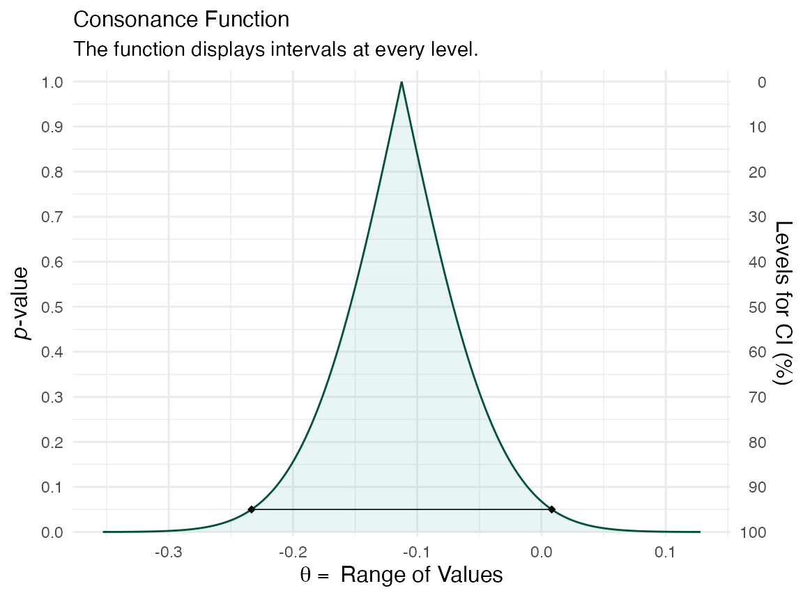
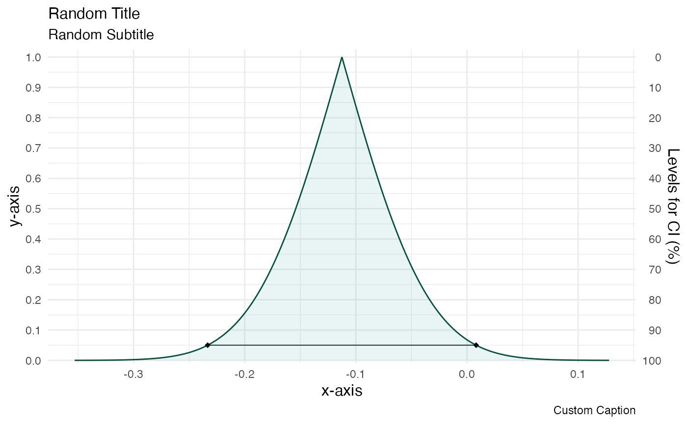
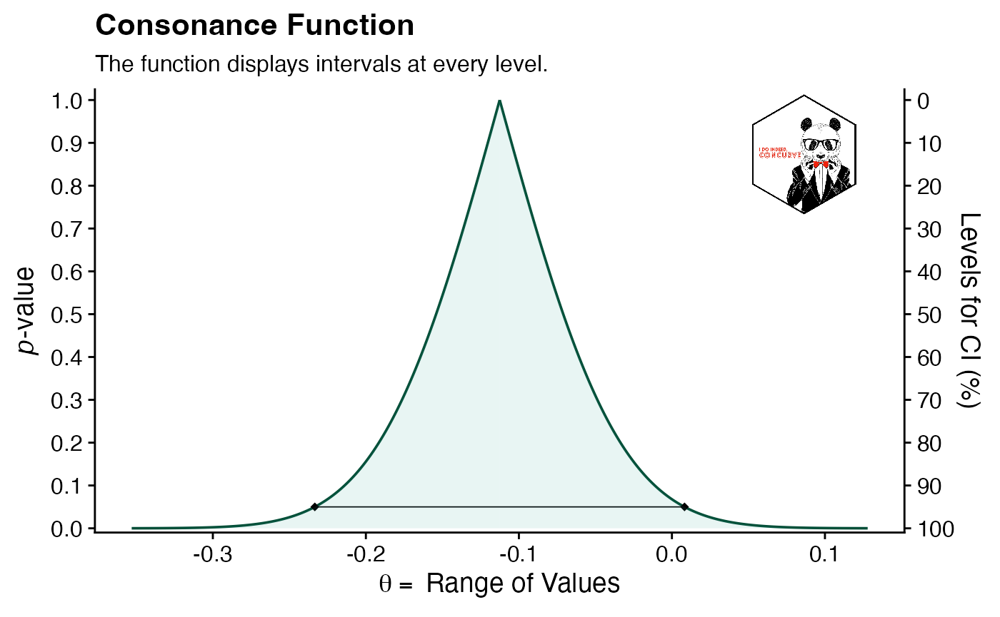
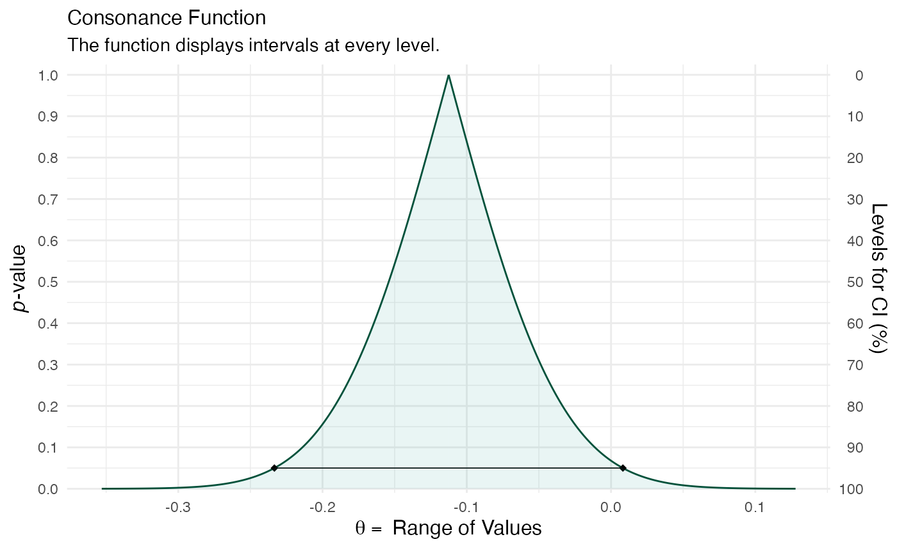
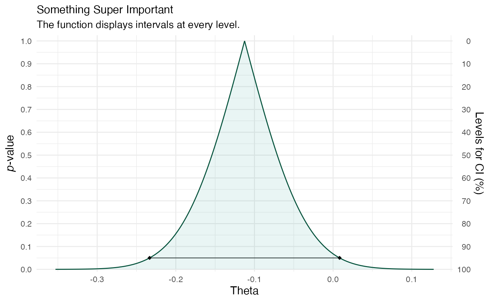
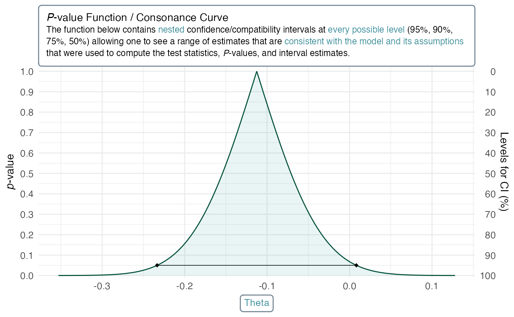

# Customizing Plots

## A Universal Grammar of Graphics

Because `concurve` graphs functions via `ggplot2`, it is quite easy to
customize parts of the plot beyond some of the arguments that are
provided in the [`ggcurve()`](reference/ggcurve.md) function. For
example, we are able to provide arguments to the function to give custom
titles, subtitles, x-axes, y-axes, fills, and colors. However, we could
also do this using the standard `ggplot2` grammar. We’ll generate a
quick graph to show how.

``` r

library(concurve)
#> Please see the documentation on https://data.lesslikely.com/concurve/ or by typing `help(concurve)`
set.seed(1031)
GroupA <- rnorm(500)
GroupB <- rnorm(500)
RandomData <- data.frame(GroupA, GroupB)
intervalsdf <- curve_mean(GroupA, GroupB,
  data = RandomData, method = "default"
)
(function1 <- ggcurve(data = intervalsdf[[1]], type = "c", nullvalue = TRUE))
#> Warning: Using `size` aesthetic for lines was deprecated in ggplot2 3.4.0.
#> ℹ Please use `linewidth` instead.
#> ℹ The deprecated feature was likely used in the concurve package.
#>   Please report the issue at <https://github.com/zadrafi/concurve/issues>.
#> This warning is displayed once per session.
#> Call `lifecycle::last_lifecycle_warnings()` to see where this warning was
#> generated.
```



Those are some of the default options provided to
[`ggcurve()`](reference/ggcurve.md). We could provide
[`ggcurve()`](reference/ggcurve.md) arguments for the title, subtitle,
etc, but we could also do it like so:

``` r

library(ggplot2)
function1 +
  labs(
    title = "Random Title",
    subtitle = "Random Subtitle",
    x = "x-axis",
    y = "y-axis",
    caption = "Custom Caption"
  )
```



If we even wanted to provide a custom theme, we could do the following.

``` r

library(cowplot)
logo_file <- "https://res.cloudinary.com/less-likely/image/upload/v1575441662/Site/Logo2.jpg"

function1 <- function1 +
  theme_cowplot()

function2 <- ggdraw(function1) +
  draw_image(logo_file, x = 1, y = 1, hjust = 2, vjust = 1.75, width = 0.13, height = 0.2)

function2
```



I’ve only tried testing this with the `cowplot` package, so I cannot say
for sure that the functions won’t break when applied with other
themes.^([**Wilke_2019?**](#ref-Wilke_2019))

## More Advanced Customization

Although the above shows how flexible `concurve`’s
[`ggcurve()`](reference/ggcurve.md) is due to the integration with the
`ggplot2` framework, we can achieve much more with a newer package
called
`ggtext`.^([**wilkeGgtextImprovedText2020?**](#ref-wilkeGgtextImprovedText2020))
If we wanted to fully control how the labels and titles in our graphs
looked or insert textboxes with full control, we could easily do that
with `ggtext.`

Before we used `cowplot`, here’s what our plain function looked like
(after regenerating it from scratch)

``` r

(function1 <- ggcurve(data = intervalsdf[[1]], type = "c", nullvalue = TRUE))
```



Simple enough, eh?

Okay, but if we wanted to have more fine control over how the title and
axes look, we could do that. Here’s how:

We take our existing object function and we specify all the usual
options for the titles, axes, etc

``` r

(function1 <- ggcurve(data = intervalsdf[[1]], type = "c", nullvalue = TRUE, title = "Something Super Important", xaxis = "Theta"))
```



But now, instead of doing that above, we’ll use a different style to
control the size, form, and color of the text. We’ll load `ggtext` and
then specify the arguments.

``` r

library(ggtext)

function1 <- ggcurve(data = intervalsdf[[1]], type = "c", nullvalue = TRUE, title = "Something Super Important", xaxis = "<span style = 'color:#3f8f9b;'>Theta</span> ")

function1 +
  labs(
    title = "*P*-value Function / Consonance Curve<br><span style = 'font-size:9pt;'>
The function below contains <span style = 'color:#3f8f9b;'>nested</span> confidence/compatibility intervals at <span style = 'color:#3f8f9b;'>every possible level</span> (95%, 90%, 75%, 50%)
allowing one to see a range of estimates that are <span style = 'color:#3f8f9b;'>consistent with the model and its assumptions</span> that were used to compute
the test statistics, *P*-values, and interval estimates. </span>",
    subtitle = NULL
  ) +
  theme(
    plot.title = element_textbox_simple(
      size = 11, lineheight = 1.1,
      linetype = 1, # turn on border
      box.color = "#748696", # border color
      fill = "white", # background fill color
      r = grid::unit(3, "pt"),
      padding = margin(8, 8, 8, 8), # padding around text inside the box
      maxwidth = unit(8, "in"), # margin outside the box
    ),
    axis.text = element_text(size = 10),
    axis.title.y = element_text(size = 11),
    axis.title.x = element_textbox_simple(
      size = 10,
      width = NULL,
      padding = margin(4, 4, 4, 4),
      margin = margin(4, 0, 0, 0),
      linetype = 1,
      r = grid::unit(3, "pt"),
      box.color = "#748696", # border color
      fill = "white", # background fill color
    )
  )
```



As you might have noticed above, we can control the size of the text,
the color of it, whether it’s bolded, italicized, etc., and that’s
partially because it uses markdown.

## Saving Plots

The most common way useRs save plots is by going to the plots tab in an
IDE like RStudio and clicking “export” and then “save as image” or by
using [`ggsave()`](https://ggplot2.tidyverse.org/reference/ggsave.html),
however, `cowplot` has a superior function with far better default
options built into it known as
[`save_plot()`](https://wilkelab.org/cowplot/reference/save_plot.html).

``` r

save_plot("function2.pdf", function2)
```

Previously, it was quite difficult to save consonance functions as .svg
files or as .pdf files because there was so much information in the
graphs that R would often crash. However, this is no longer the case and
can easily be done with the `svglite` package. Once again, we use the
same command from above.

``` r

library(svglite)
library(ggplot2)

res <- 144
svglite("pvalfunc.svg", width = 720 / res, height = 500 / res)
(function1 <- ggcurve(data = intervalsdf[[1]], type = "c", nullvalue = TRUE))
dev.off()
#> agg_png 
#>       2
```

## Cite R packages

Please remember to cite the packages that you use.

``` r

citation("concurve")
#> To cite package 'concurve' in publications use:
#> 
#>   Rafi Z, Vigotsky A (????). _concurve: Computes and Plots
#>   Compatibility (Confidence) Intervals, P-Values, S-Values, &
#>   Likelihood Intervals to Form Consonance, Surprisal, & Likelihood
#>   Functions_. R package version 3.0,
#>   <https://CRAN.R-project.org/package=concurve>.
#> 
#>   Rafi Z, Greenland S (2020). "Semantic and Cognitive Tools to Aid
#>   Statistical Science: Replace Confidence and Significance by
#>   Compatibility and Surprise." _BMC Medical Research Methodology_,
#>   *20*, 244. ISSN 1471-2288, doi:10.1186/s12874-020-01105-9
#>   <https://doi.org/10.1186/s12874-020-01105-9>,
#>   <https://doi.org/10.1186/s12874-020-01105-9>.
#> 
#> To see these entries in BibTeX format, use 'print(<citation>,
#> bibtex=TRUE)', 'toBibtex(.)', or set
#> 'options(citation.bibtex.max=999)'.
citation("ggplot2")
#> To cite ggplot2 in publications, please use
#> 
#>   H. Wickham. ggplot2: Elegant Graphics for Data Analysis.
#>   Springer-Verlag New York, 2016.
#> 
#> A BibTeX entry for LaTeX users is
#> 
#>   @Book{,
#>     author = {Hadley Wickham},
#>     title = {ggplot2: Elegant Graphics for Data Analysis},
#>     publisher = {Springer-Verlag New York},
#>     year = {2016},
#>     isbn = {978-3-319-24277-4},
#>     url = {https://ggplot2.tidyverse.org},
#>   }
citation("ggtext")
#> To cite package 'ggtext' in publications use:
#> 
#>   Wilke C, Wiernik B (2022). _ggtext: Improved Text Rendering Support
#>   for 'ggplot2'_. doi:10.32614/CRAN.package.ggtext
#>   <https://doi.org/10.32614/CRAN.package.ggtext>, R package version
#>   0.1.2, <https://CRAN.R-project.org/package=ggtext>.
#> 
#> A BibTeX entry for LaTeX users is
#> 
#>   @Manual{,
#>     title = {ggtext: Improved Text Rendering Support for 'ggplot2'},
#>     author = {Claus O. Wilke and Brenton M. Wiernik},
#>     year = {2022},
#>     note = {R package version 0.1.2},
#>     url = {https://CRAN.R-project.org/package=ggtext},
#>     doi = {10.32614/CRAN.package.ggtext},
#>   }
citation("cowplot")
#> To cite package 'cowplot' in publications use:
#> 
#>   Wilke C (2025). _cowplot: Streamlined Plot Theme and Plot Annotations
#>   for 'ggplot2'_. doi:10.32614/CRAN.package.cowplot
#>   <https://doi.org/10.32614/CRAN.package.cowplot>, R package version
#>   1.2.0, <https://CRAN.R-project.org/package=cowplot>.
#> 
#> A BibTeX entry for LaTeX users is
#> 
#>   @Manual{,
#>     title = {cowplot: Streamlined Plot Theme and Plot Annotations for 'ggplot2'},
#>     author = {Claus O. Wilke},
#>     year = {2025},
#>     note = {R package version 1.2.0},
#>     url = {https://CRAN.R-project.org/package=cowplot},
#>     doi = {10.32614/CRAN.package.cowplot},
#>   }
```
