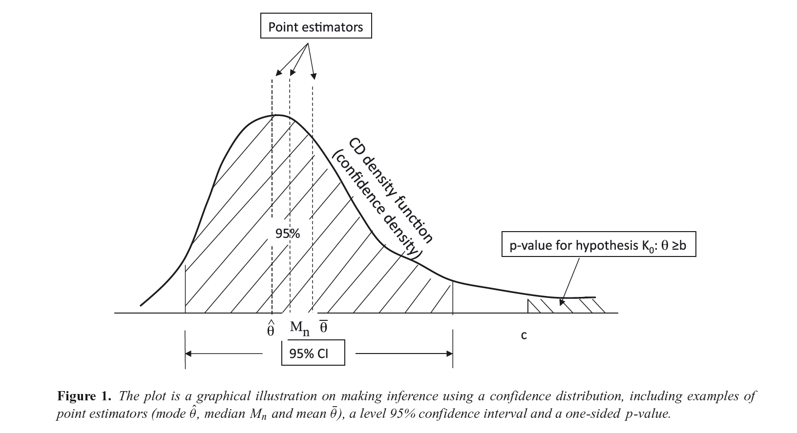
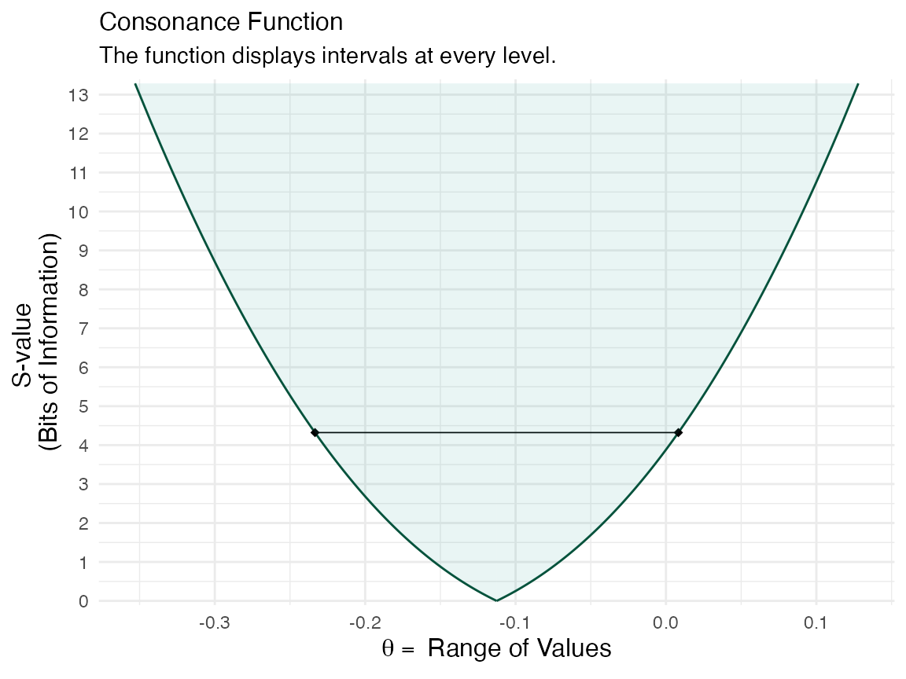
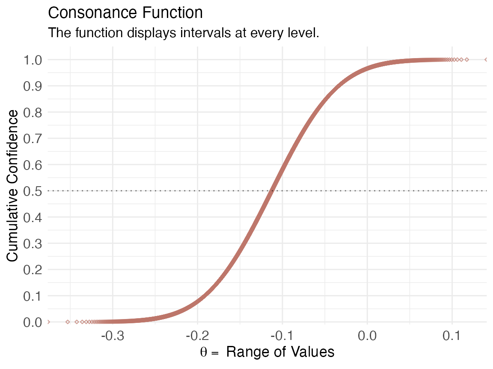
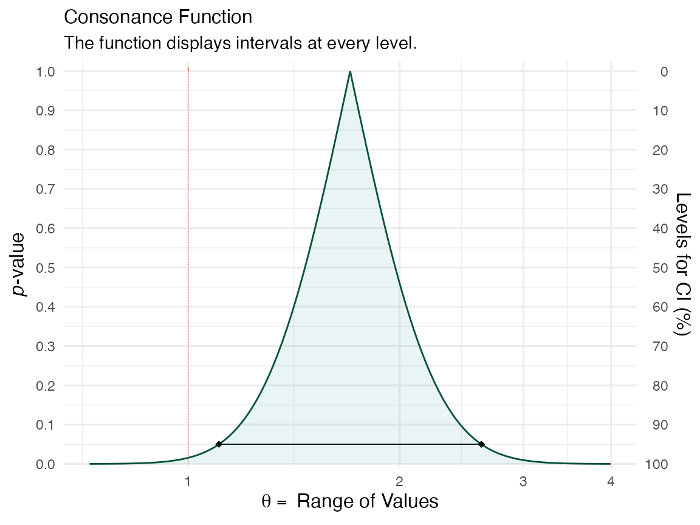
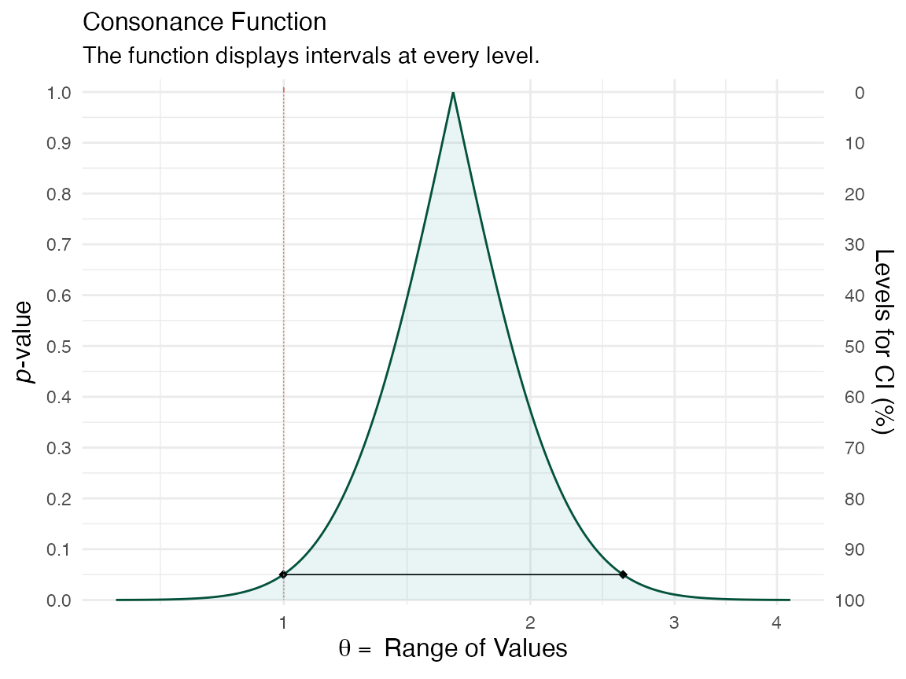
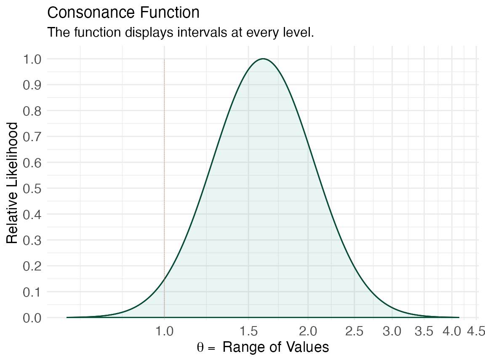
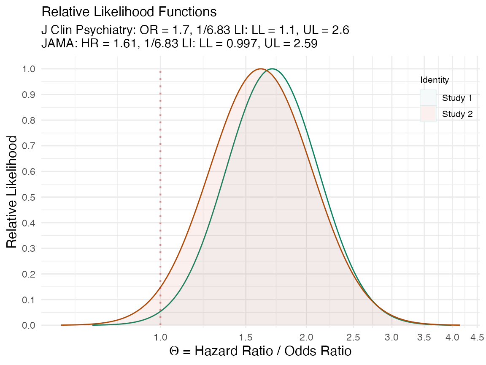
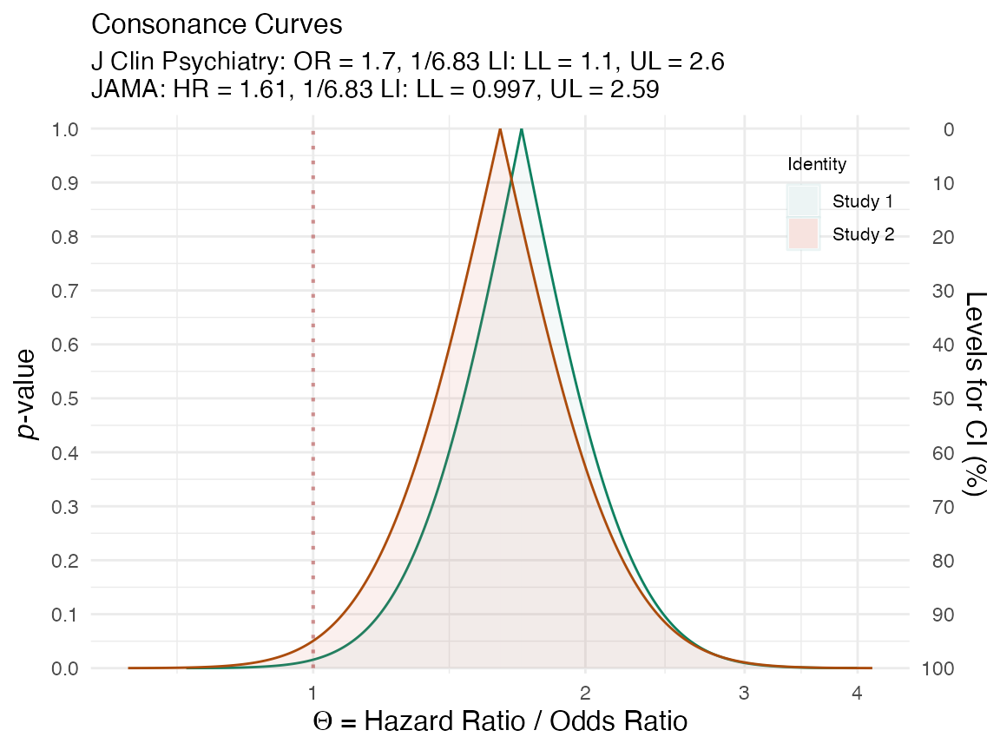

# Examples in R

## Introduction

Here I show how to produce *P*-value, *S*-value, likelihood, and
deviance functions with the `concurve` package using fake data and data
from real studies. Simply put, these functions are rich sources of
information for scientific inference and the image below, taken from Xie
& Singh, 2013\[@^([1](#ref-xieConfidenceDistributionFrequentist2013));\]
displays why.



For a more extensive discussion of these concepts, see the following
references.^([1](#ref-xieConfidenceDistributionFrequentist2013)–[16](#ref-coxDiscussion2013))

## Simple Models

First, I’d like to get started with very simple scenarios, where we
could generate some normal data and combine two vectors in a dataframe,

``` r

library(concurve)
#> Please see the documentation on https://data.lesslikely.com/concurve/ or by typing `help(concurve)`
set.seed(1031)
GroupA <- rnorm(500)
GroupB <- rnorm(500)
RandomData <- data.frame(GroupA, GroupB)
```

and then look at the differences between the two vectors. We’ll plug
these vectors and the dataframe and now they’re inside of the
[`curve_mean()`](reference/curve_mean.md) function. Here, the default
method involves calculating CIs using the Wald method.

``` r

intervalsdf <- curve_mean(GroupA, GroupB,
  data = RandomData, method = "default"
)
```

Each of the functions within `concurve` will generally produce a list
with three items, and the first will usually contain the function of
interest. Here, we are looking at the first ten results of the first
list of the previous item that we constructed.

``` r

head(intervalsdf[[1]], 10)
#>    lower.limit upper.limit intrvl.width intrvl.level     cdf pvalue
#> 1   -0.1125581  -0.1125581 0.000000e+00        0e+00 0.50000 1.0000
#> 2   -0.1125658  -0.1125504 1.543412e-05        1e-04 0.50005 0.9999
#> 3   -0.1125736  -0.1125427 3.086824e-05        2e-04 0.50010 0.9998
#> 4   -0.1125813  -0.1125350 4.630236e-05        3e-04 0.50015 0.9997
#> 5   -0.1125890  -0.1125273 6.173649e-05        4e-04 0.50020 0.9996
#> 6   -0.1125967  -0.1125195 7.717061e-05        5e-04 0.50025 0.9995
#> 7   -0.1126044  -0.1125118 9.260473e-05        6e-04 0.50030 0.9994
#> 8   -0.1126122  -0.1125041 1.080389e-04        7e-04 0.50035 0.9993
#> 9   -0.1126199  -0.1124964 1.234730e-04        8e-04 0.50040 0.9992
#> 10  -0.1126276  -0.1124887 1.389071e-04        9e-04 0.50045 0.9991
#>          svalue
#> 1  0.0000000000
#> 2  0.0001442767
#> 3  0.0002885679
#> 4  0.0004328734
#> 5  0.0005771935
#> 6  0.0007215279
#> 7  0.0008658768
#> 8  0.0010102402
#> 9  0.0011546179
#> 10 0.0012990102
```

That gives us a very comprehensive table, but it can be difficult to
parse through, so luckily, we can view a graphical function using the
[`ggcurve()`](reference/ggcurve.md) function. The basic arguments that
must be provided are the data argument and the “type” argument. To plot
a consonance/confidence function, we would write “`c`”.

``` r

(function1 <- ggcurve(data = intervalsdf[[1]], type = "c", nullvalue = NULL))
#> Warning: Using `size` aesthetic for lines was deprecated in ggplot2 3.4.0.
#> ℹ Please use `linewidth` instead.
#> ℹ The deprecated feature was likely used in the concurve package.
#>   Please report the issue at <https://github.com/zadrafi/concurve/issues>.
#> This warning is displayed once per session.
#> Call `lifecycle::last_lifecycle_warnings()` to see where this warning was
#> generated.
```


We can see that the consonance “curve” is every interval estimate
plotted, and provides the *P*-values, CIs, along with the **median
unbiased estimate** It can be defined as such,

\\C V\_{n}(\theta)=1-2\left\|H\_{n}(\theta)-0.5\right\|=2 \min
\left\\H\_{n}(\theta), 1-H\_{n}(\theta)\right\\\\

Its information transformation, the surprisal function, which closely
maps to the deviance function, can be constructed by taking the
\\-log\_{2}\\ of the observed
*P*-value.^([3](#ref-rafiSemanticCognitiveTools2020),[17](#ref-greenlandValidPvaluesBehave2019),[18](#ref-Shannon1948-uq))

To view the surprisal function, we simply change the type to “`s`” in
[`ggcurve()`](reference/ggcurve.md).

``` r

(function1 <- ggcurve(data = intervalsdf[[1]], type = "s"))
```



We can also view the consonance distribution by changing the type to
“`cdf`”, which is a cumulative probability distribution, also more
formally known as the “confidence distribution”. The point at which the
curve reaches 0.5/50% is known as the “**median unbiased estimate**”. It
is the same estimate that is typically at the peak of the confidencr
curve from above, but this is not always the case.

``` r

(function1s <- ggcurve(data = intervalsdf[[2]], type = "cdf", nullvalue = NULL))
```



We can also get relevant statistics that show the range of values by
using the [`curve_table()`](reference/curve_table.md) function. The
tables can also be exported in several formats such as .docx, .ppt,
images, and TeX files.

``` r

(x <- curve_table(data = intervalsdf[[1]], format = "image"))
```

| Lower Limit | Upper Limit | Interval Width | Interval Level (%) | CDF | P-value | S-value (bits) |
|----|----|----|----|----|----|----|
| -0.132 | -0.093 | 0.039 | 25.0 | 0.625 | 0.750 | 0.415 |
| -0.154 | -0.071 | 0.083 | 50.0 | 0.750 | 0.500 | 1.000 |
| -0.183 | -0.042 | 0.142 | 75.0 | 0.875 | 0.250 | 2.000 |
| -0.192 | -0.034 | 0.158 | 80.0 | 0.900 | 0.200 | 2.322 |
| -0.201 | -0.024 | 0.177 | 85.0 | 0.925 | 0.150 | 2.737 |
| -0.214 | -0.011 | 0.203 | 90.0 | 0.950 | 0.100 | 3.322 |
| -0.233 | 0.008 | 0.242 | 95.0 | 0.975 | 0.050 | 4.322 |
| -0.251 | 0.026 | 0.276 | 97.5 | 0.988 | 0.025 | 5.322 |
| -0.271 | 0.046 | 0.318 | 99.0 | 0.995 | 0.010 | 6.644 |

## Comparing Functions

If we wanted to compare two studies or even two datasets to see the
amount of “consonance/concordance”, we could use the
[`curve_compare()`](reference/curve_compare.md) function to get a very
rough numerical output.

First, we generate some more fake data, that you would be unlikely to
see in the real world, but that serves as a great tutorial.

``` r

GroupA2 <- rnorm(500)
GroupB2 <- rnorm(500)
RandomData2 <- data.frame(GroupA2, GroupB2)
model <- lm(GroupA2 ~ GroupB2, data = RandomData2)
randomframe <- curve_gen(model, "GroupB2")
```

Once again, we’ll plot this data with
[`ggcurve()`](reference/ggcurve.md). We can also indicate whether we
want certain interval estimates to be plotted in the function with the
“`levels`” argument. If we wanted to plot the **50**%, **75**%, and
**95**% intervals, we’d provide the argument this way:

Now that we have two datasets, and two functions, we can compare them
using the [`plot_compare()`](reference/plot_compare.md) function.

This function will provide us with the area that is shared between the
curve, along with a ratio of overlap to non-overlap.

Another way to compare the functions is to use the `cowplot` &
[`plot_grid()`](https://wilkelab.org/cowplot/reference/plot_grid.html)
functions, which I am mostly beginning to lean towards to.

It’s clear that the outputs have changed and indicate far more overlap
than before. A very useful and easy way to spot differences or lack of
them.

## Constructing Functions From Single Intervals

We can also take a set of confidence limits and use them to construct a
consonance, surprisal, likelihood or deviance function using the
[`curve_rev()`](reference/curve_rev.md) function. This method is
computed from the approximate normal distribution, but there are several
caveats and scenarios in which it can break down, so I would recommend
visiting the reference page and reading the documentation,
[`curve_rev()`](reference/curve_rev.md). In general, those settings that
conflict with such scenarios are not the default settings and I would
feel uncomfortable to keep them that way.

For this next example, we’ll use two epidemiological
studies^([19](#ref-brownAssociationSerotonergicAntidepressant2017),[20](#ref-brownAssociationAntenatalExposure2017))
that studied the impact of selective serotonin reuptake inhibitor
exposure in pregnant mothers, and the association with the rate of
autism in newborn childs.

The second of these studies suggested a null effect of SSRI exposure on
autism rates in children, due to the lack of statistical significance,
whereas the first one “found” an effect”. The authors claimed that the
two studies they conducted clear contradict one another. However, this
was a complete misinterpretation of their own results.

Here I take the reported effect estimates from both studies, the
confidence limits, and use them to reconstruct entire confidence curves
to show how much the results truly differed.

``` r

curve1 <- curve_rev(point = 1.7, LL = 1.1, UL = 2.6, type = "c", measure = "ratio", steps = 10000)
#> [1] 0.2194431
(ggcurve(data = curve1[[1]], type = "c", measure = "ratio", nullvalue = c(1)))
```



``` r

curve2 <- curve_rev(point = 1.61, LL = 0.997, UL = 2.59, type = "c", measure = "ratio", steps = 10000)
#> [1] 0.2435408
(ggcurve(data = curve2[[1]], type = "c", measure = "ratio", nullvalue = c(1)))
```



The null value is shown via the red line and a large portion of bnoth of
the confidence curves are away from it. We can also see this by plotting
the likelihood functions via the [`curve_rev()`](reference/curve_rev.md)
function.

We can specify that we want a likelihood function using curve_rev() by
specifying “l” for the type argument.

``` r

lik1 <- curve_rev(point = 1.7, LL = 1.1, UL = 2.6, type = "l", measure = "ratio", steps = 10000)
#> [1] 0.2194431
(ggcurve(data = lik1[[1]], type = "l1", measure = "ratio", nullvalue = c(1)))
```


``` r

lik2 <- curve_rev(point = 1.61, LL = 0.997, UL = 2.59, type = "l", measure = "ratio", steps = 10000)
#> [1] 0.2435408
(ggcurve(data = lik2[[1]], type = "l1", measure = "ratio", nullvalue = c(1)))
```



We can also view the amount of agreement between the likelihood
functions of these two studies using the plot_compare function and
producing areas shared between the curves.

``` r

(plot_compare(
  data1 = lik1[[1]], data2 = lik2[[1]], type = "l1", measure = "ratio", nullvalue = TRUE, title = "Brown et al. 2017. J Clin Psychiatry. vs. \nBrown et al. 2017. JAMA.",
  subtitle = "J Clin Psychiatry: OR = 1.7, 1/6.83 LI: LL = 1.1, UL = 2.6 \nJAMA: HR = 1.61, 1/6.83 LI: LL = 0.997, UL = 2.59", xaxis = expression(Theta ~ "= Hazard Ratio / Odds Ratio")
))
```



We can also do the same with the confidence curves.

``` r

(plot_compare(
  data1 = curve1[[1]], data2 = curve2[[1]], type = "c", measure = "ratio", nullvalue = TRUE, title = "Brown et al. 2017. J Clin Psychiatry. vs. \nBrown et al. 2017. JAMA.",
  subtitle = "J Clin Psychiatry: OR = 1.7, 1/6.83 LI: LL = 1.1, UL = 2.6 \nJAMA: HR = 1.61, 1/6.83 LI: LL = 0.997, UL = 2.59", xaxis = expression(Theta ~ "= Hazard Ratio / Odds Ratio")
))
```



This vignette was meant to be a very simple introduction to the concept
of the confidence curve and how it relates to the likelihood function,
and how both of these functions are much richer sources of information
that single numerical estimates. For more detailed vignettes and
explanations, please see some of the other articles listed on this [site
here.](https://data.lesslikely.com/concurve/articles/index.html)

## Cite R Packages

Please remember to cite the R packages that you use in your work.

``` r

citation("concurve")
#> To cite package 'concurve' in publications use:
#> 
#>   Rafi Z, Vigotsky A (????). _concurve: Computes and Plots
#>   Compatibility (Confidence) Intervals, P-Values, S-Values, &
#>   Likelihood Intervals to Form Consonance, Surprisal, & Likelihood
#>   Functions_. R package version 3.0,
#>   <https://CRAN.R-project.org/package=concurve>.
#> 
#>   Rafi Z, Greenland S (2020). "Semantic and Cognitive Tools to Aid
#>   Statistical Science: Replace Confidence and Significance by
#>   Compatibility and Surprise." _BMC Medical Research Methodology_,
#>   *20*, 244. ISSN 1471-2288, doi:10.1186/s12874-020-01105-9
#>   <https://doi.org/10.1186/s12874-020-01105-9>,
#>   <https://doi.org/10.1186/s12874-020-01105-9>.
#> 
#> To see these entries in BibTeX format, use 'print(<citation>,
#> bibtex=TRUE)', 'toBibtex(.)', or set
#> 'options(citation.bibtex.max=999)'.
citation("cowplot")
#> To cite package 'cowplot' in publications use:
#> 
#>   Wilke C (2025). _cowplot: Streamlined Plot Theme and Plot Annotations
#>   for 'ggplot2'_. doi:10.32614/CRAN.package.cowplot
#>   <https://doi.org/10.32614/CRAN.package.cowplot>, R package version
#>   1.2.0, <https://CRAN.R-project.org/package=cowplot>.
#> 
#> A BibTeX entry for LaTeX users is
#> 
#>   @Manual{,
#>     title = {cowplot: Streamlined Plot Theme and Plot Annotations for 'ggplot2'},
#>     author = {Claus O. Wilke},
#>     year = {2025},
#>     note = {R package version 1.2.0},
#>     url = {https://CRAN.R-project.org/package=cowplot},
#>     doi = {10.32614/CRAN.package.cowplot},
#>   }
```

------------------------------------------------------------------------

## References

------------------------------------------------------------------------

1\.

Xie M, Singh K. Confidence Distribution, the Frequentist Distribution
Estimator of a Parameter: A Review. *International Statistical Review*.
2013;81(1):3-39.
doi:[10.1111/insr.12000](https://doi.org/10.1111/insr.12000)

2\.

Birnbaum A. A unified theory of estimation, I. *The Annals of
Mathematical Statistics*. 1961;32(1):112-135.
doi:[10.1214/aoms/1177705145](https://doi.org/10.1214/aoms/1177705145)

3\.

Rafi Z, Greenland S. Semantic and cognitive tools to aid statistical
science: Replace confidence and significance by compatibility and
surprise. *BMC Medical Research Methodology*. 2020;20(1):244.
doi:[10.1186/s12874-020-01105-9](https://doi.org/10.1186/s12874-020-01105-9)

4\.

Fraser DAS. The P-value function and statistical inference. *The
American Statistician*. 2019;73(sup1):135-147.
doi:[10.1080/00031305.2018.1556735](https://doi.org/10.1080/00031305.2018.1556735)

5\.

Fraser DAS. P-Values: The Insight to Modern Statistical Inference.
*Annual Review of Statistics and Its Application*. 2017;4(1):1-14.
doi:[10.1146/annurev-statistics-060116-054139](https://doi.org/10.1146/annurev-statistics-060116-054139)

6\.

Poole C. Beyond the confidence interval. *American Journal of Public
Health*. 1987;77(2):195-199.
doi:[10.2105/AJPH.77.2.195](https://doi.org/10.2105/AJPH.77.2.195)

7\.

Poole C. Confidence intervals exclude nothing. *American Journal of
Public Health*. 1987;77(4):492-493.
doi:[10.2105/ajph.77.4.492](https://doi.org/10.2105/ajph.77.4.492)

8\.

Schweder T, Hjort NL. Confidence and Likelihood\*. *Scandinavian Journal
of Statistics*. 2002;29(2):309-332.
doi:[10.1111/1467-9469.00285](https://doi.org/10.1111/1467-9469.00285)

9\.

Schweder T, Hjort NL. *Confidence, Likelihood, Probability: Statistical
Inference with Confidence Distributions*. Cambridge University Press;
2016.
[https://books.google.com/books/about/Confidence_Likelihood_Probability.html?id=t7KzCwAAQBAJ.](https://books.google.com/books/about/Confidence_Likelihood_Probability.html?id=t7KzCwAAQBAJ)

10\.

Singh K, Xie M, Strawderman WE. Confidence distribution (CD) –
distribution estimator of a parameter. *arXiv*. August 2007.
[https://arxiv.org/abs/0708.0976.](https://arxiv.org/abs/0708.0976)

11\.

Sullivan KM, Foster DA. Use of the confidence interval function.
*Epidemiology*. 1990;1(1):39-42.
doi:[10.1097/00001648-199001000-00009](https://doi.org/10.1097/00001648-199001000-00009)

12\.

Whitehead J. The case for frequentism in clinical trials. *Statistics in
Medicine*. 1993;12(15-16):1405-1413.
doi:[10.1002/sim.4780121506](https://doi.org/10.1002/sim.4780121506)

13\.

Rothman KJ, Greenland S, Lash TL. Precision and statistics in
epidemiologic studies. In: Rothman KJ, Greenland S, Lash TL, eds.
*Modern Epidemiology*. 3rd ed. Lippincott Williams & Wilkins;
2008:148-167.
[https://books.google.com/books/about/Modern_Epidemiology.html?id=Z3vjT9ALxHUC.](https://books.google.com/books/about/Modern_Epidemiology.html?id=Z3vjT9ALxHUC)

14\.

Rücker G, Schwarzer G. Beyond the forest plot: The drapery plot.
*Research Synthesis Methods*. April 2020.
doi:[10.1002/jrsm.1410](https://doi.org/10.1002/jrsm.1410)

15\.

Rothman KJ, Johnson ES, Sugano DS. Is flutamide effective in patients
with bilateral orchiectomy? *The Lancet*. 1999;353(9159):1184.
doi:[10.1016/s0140-6736(05)74403-2](https://doi.org/10.1016/s0140-6736(05)74403-2)

16\.

Cox DR. Discussion. *International Statistical Review*.
2013;81(1):40-41. doi:[10/gg9s2f](https://doi.org/10/gg9s2f)

17\.

Greenland S. Valid P-values behave exactly as they should: Some
misleading criticisms of P-values and their resolution with S-values.
*The American Statistician*. 2019;73(sup1):106-114.
doi:[10.1080/00031305.2018.1529625](https://doi.org/10.1080/00031305.2018.1529625)

18\.

Shannon CE. A mathematical theory of communication. *The Bell System
Technical Journal*. 1948;27(3):379-423.
doi:[10.1002/j.1538-7305.1948.tb01338.x](https://doi.org/10.1002/j.1538-7305.1948.tb01338.x)

19\.

Brown HK, Ray JG, Wilton AS, Lunsky Y, Gomes T, Vigod SN. Association
between serotonergic antidepressant use during pregnancy and autism
spectrum disorder in children. *Journal of the American Medical
Association*. 2017;317(15):1544-1552.
doi:[10.1001/jama.2017.3415](https://doi.org/10.1001/jama.2017.3415)

20\.

Brown HK, Hussain-Shamsy N, Lunsky Y, Dennis C-LE, Vigod SN. The
association between antenatal exposure to selective serotonin reuptake
inhibitors and autism: A systematic review and meta-analysis. *The
Journal of Clinical Psychiatry*. 2017;78(1):e48-e58.
doi:[10.4088/JCP.15r10194](https://doi.org/10.4088/JCP.15r10194)
