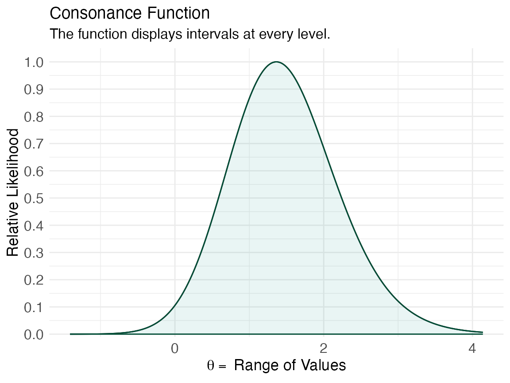
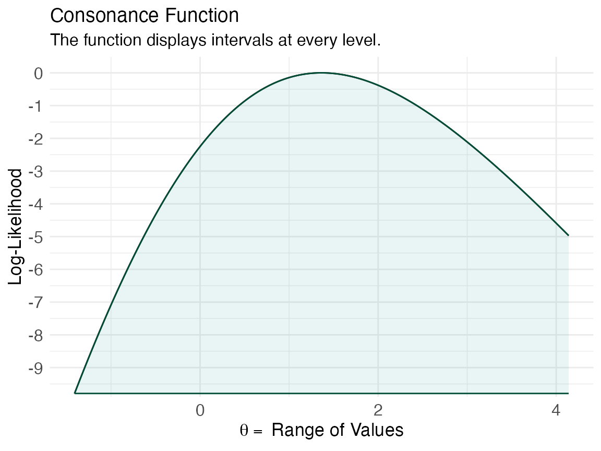
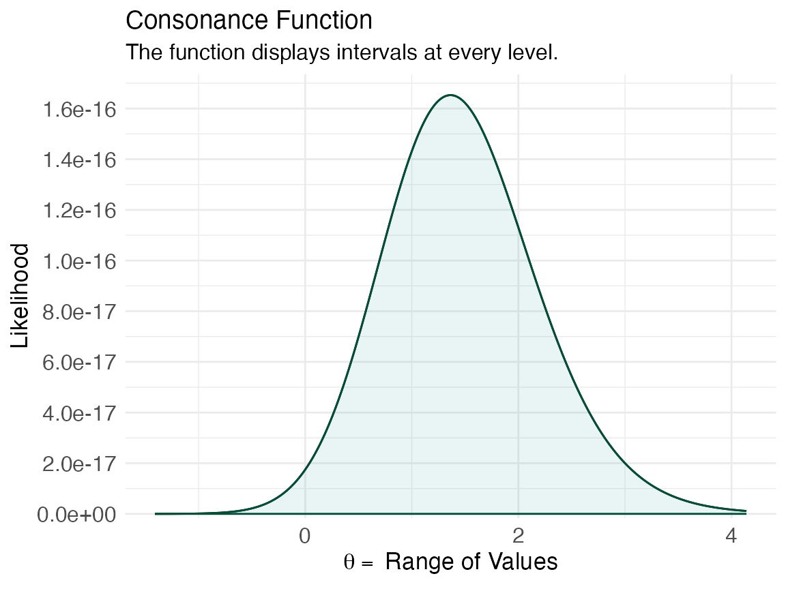
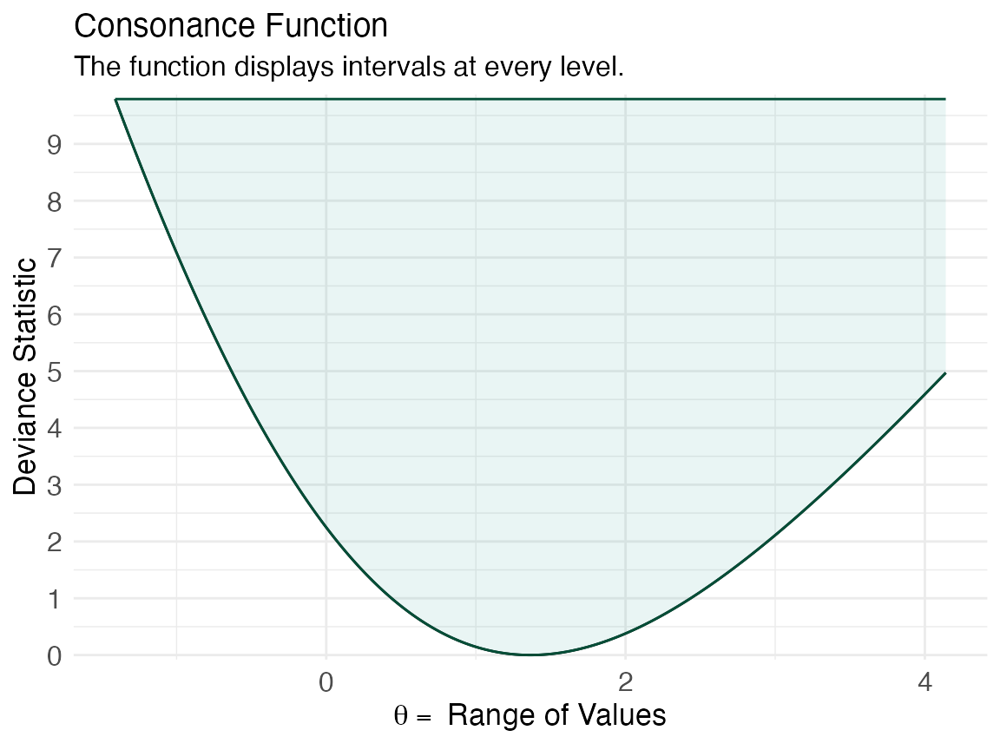

# Profile Likelihoods

For this example, we’ll explore the
[`curve_lik()`](reference/curve_lik.md) function, which can help
generate profile likelihood functions, and deviance functions with the
help of the
[`ProfileLikelihood`](https://cran.r-project.org/package=ProfileLikelihood)
package.^([1](#ref-choiProfileLikelihoodProfileLikelihood2011)). For an
introduction to what profile likelihoods are, [see the following
paper.](https://doi.org/10.1093/aje/kwt245)^([2](#ref-coleMaximumLikelihoodProfile2013))

``` r

library(ProfileLikelihood)
```

We’ll use a simple example taken directly from the
[`ProfileLikelihood`](https://cran.r-project.org/package=ProfileLikelihood)
documentation where we’ll calculate the likelihoods from a glm model

``` r

data(dataglm)
xx <- profilelike.glm(y ~ x1 + x2,
  data = dataglm, profile.theta = "group",
  family = binomial(link = "logit"), length = 500, round = 2
)
#> Warning message: provide lo.theta and hi.theta
```

Then, we’ll use [`curve_lik()`](reference/curve_lik.md) on the object
that the
[`ProfileLikelihood`](https://cran.r-project.org/package=ProfileLikelihood)
package produced.

``` r

lik <- curve_lik(xx, data = dataglm)
```

Next, we’ll plot four functions, the relative likelihood, the
log-likelihood, the likelihood, and the deviance function.

``` r

ggcurve(lik[[1]], type = "l1", nullvalue = TRUE)
```



``` r

ggcurve(lik[[1]], type = "l2")
```



``` r

ggcurve(lik[[1]], type = "l3")
```



``` r

ggcurve(lik[[1]], type = "d")
```



The obvious advantage of using reduced likelihoods is that they are free
of nuisance parameters

``` math
L_{t_{n}}(\theta)=f_{n}\left(F_{n}^{-1}\left(H_{p i v}(\theta)\right)\right)\left|\frac{\partial}{\partial t} \psi\left(t_{n}, \theta\right)\right|=h_{p i v}(\theta)\left|\frac{\partial}{\partial t} \psi(t, \theta)\right| /\left.\left|\frac{\partial}{\partial \theta} \psi(t, \theta)\right|\right|_{t=t_{n}}
```
thus, giving summaries of the data that can be incorporated into
combined analyses.

## Cite R Packages

Please remember to cite the packages that you use.

``` r

citation("concurve")
#> To cite package 'concurve' in publications use:
#> 
#>   Rafi Z, Vigotsky A (2026). _concurve: Computes and Plots
#>   Compatibility (Confidence) Intervals, P-Values, S-Values, &
#>   Likelihood Intervals to Form Consonance, Surprisal, & Likelihood
#>   Functions_. R package version 3.0.0,
#>   <https://CRAN.R-project.org/package=concurve>.
#> 
#>   Rafi Z, Greenland S (2020). "Semantic and Cognitive Tools to Aid
#>   Statistical Science: Replace Confidence and Significance by
#>   Compatibility and Surprise." _BMC Medical Research Methodology_,
#>   *20*, 244. ISSN 1471-2288, doi:10.1186/s12874-020-01105-9
#>   <https://doi.org/10.1186/s12874-020-01105-9>,
#>   <https://doi.org/10.1186/s12874-020-01105-9>.
#> 
#> To see these entries in BibTeX format, use 'print(<citation>,
#> bibtex=TRUE)', 'toBibtex(.)', or set
#> 'options(citation.bibtex.max=999)'.
citation("ProfileLikelihood")
#> To cite package 'ProfileLikelihood' in publications use:
#> 
#>   Choi L (2023). _ProfileLikelihood: Profile Likelihood for a Parameter
#>   in Commonly Used Statistical Models_.
#>   doi:10.32614/CRAN.package.ProfileLikelihood
#>   <https://doi.org/10.32614/CRAN.package.ProfileLikelihood>, R package
#>   version 1.3, <https://CRAN.R-project.org/package=ProfileLikelihood>.
#> 
#> A BibTeX entry for LaTeX users is
#> 
#>   @Manual{,
#>     title = {ProfileLikelihood: Profile Likelihood for a Parameter in Commonly Used Statistical
#> Models},
#>     author = {Leena Choi},
#>     year = {2023},
#>     note = {R package version 1.3},
#>     url = {https://CRAN.R-project.org/package=ProfileLikelihood},
#>     doi = {10.32614/CRAN.package.ProfileLikelihood},
#>   }
```

## References

------------------------------------------------------------------------

1\.

Choi L. ProfileLikelihood: Profile likelihood for a parameter in
commonly used statistical models. 2011.
[https://CRAN.R-project.org/package=ProfileLikelihood.](https://CRAN.R-project.org/package=ProfileLikelihood)

2\.

Cole SR, Chu H, Greenland S. Maximum Likelihood, Profile Likelihood, and
Penalized Likelihood: A Primer. *American Journal of Epidemiology*.
2013;179(2):252-260. doi:[10/f5mx4q](https://doi.org/10/f5mx4q)
