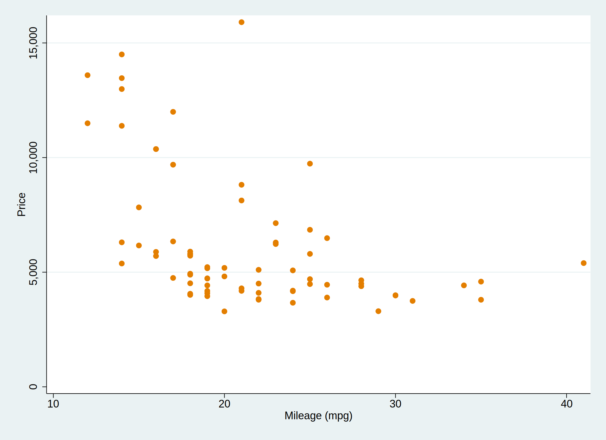
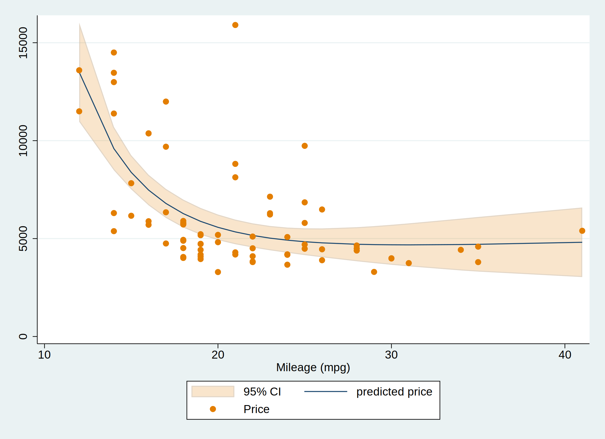
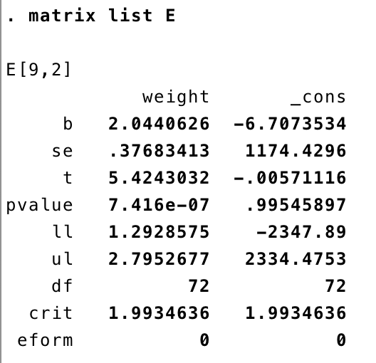
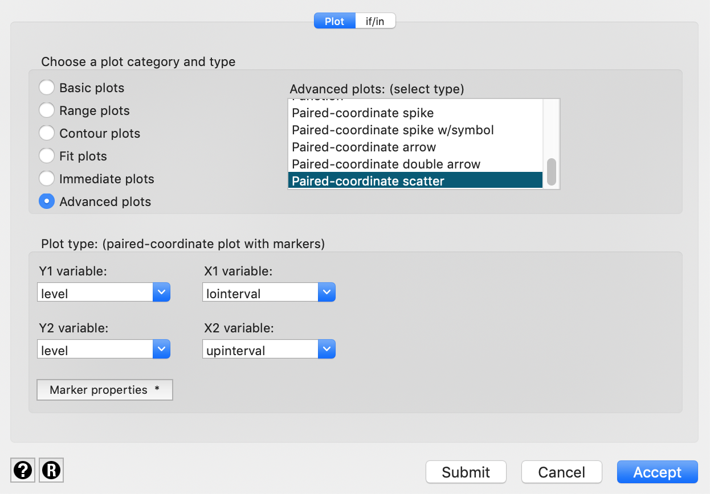
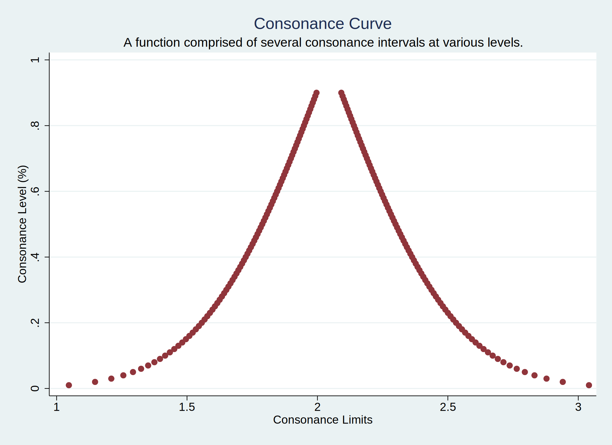
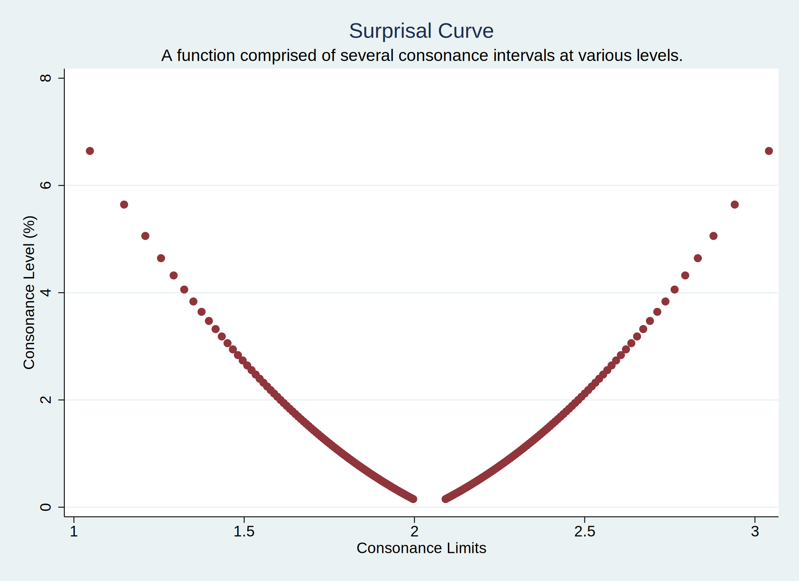

# Using Stata

Although `concurve` was originally designed to be used in `R`, it is
possible to achieve very similar results in `Stata`. We can use some
datasets that are built into `Stata` to show how to achieve this. I’ll
use the `Statamarkdown` R package so that I can obtain Stata outputs
using RMarkdown via my Stata 16 package.

First, let’s load the *auto2* dataset which contains data about cars and
their characteristics.

Browse the data set in your data browser to get more familiar with some
of the variables. Let’s say we’re interested in the relationship between
miles per gallon and price. We could fit a very simple linear model to
assess that relationship.

First, let’s visualize the data with a scatter plot.

``` stata
sysuse auto2
```



scatter

That’s what our data looks like. Clearly there seems to be an inverse
relationship between miles per gallon and price.

Now we could fit a very simple linear model with miles per gallon being
the predictor and price being the outcome and get some estimates of the
relationship.

``` stata
sysuse auto2
regress price mpg 
```

That’s what our output looks like.

Our output also gives us 95% consonance (confidence) intervals by
default. But suppose we wished to fit a fractional polynomial model and
graph it and get the confidence bands, here’s what we would do.

``` stata
sysuse auto2
mfp: glm price mpg
twoway (fpfitci price mpg, estcmd(glm) fcolor(dkorange%20) alcolor(%40))  || scatter price mpg, mcolor(dkorange) scale(0.75)
graph export "mfp.svg", replace 
```

That’s what our model looks graphed.



fractional polynomial model

Now suppose we got a single estimate (point or interval) for a
parameter, and we wanted all the intervals for it at every level.

Here’s the code that we’ll be using to achieve that in Stata.

    postfile topost level pvalue svalue lointerval upinterval using my_new_data, replace
         
    forvalues i = 10/99.9 { 
          quietly regress price mpg, level(`i')
          matrix E = r(table)
          matrix list E
          post topost (`i') (1-`i'/100) ( ln(1-`i'/100)/ln(2) * -1) (E[5,1]) (E[6,1])
        } 
        
    postclose topost
    use my_new_data, clear
    list

    twoway (pcscatter level lointerval level upinterval), 
    ytitle(Consonance Level (%)) xtitle(Consonance Limits) ///
    title(Consonance Curve) 
    subtitle(A function comprised of several consonance intervals at various levels.)

That’s a lot and may seem intimidating at first, but I’ll explain it
line by line.

    postfile topost level pvalue svalue lointerval upinterval using my_new_data, replace

“**postfile**” is the command that will be responsible for pasting the
data from our overall loop into a new dataset. Here, we are telling
`Stata` that the internal `Stata` memory used to hold these results (the
post) will be named “**topost**” and that it will have five variables,
“**level**”, “**pvalue**”, “**svalue**”, “**lointerval**”, and
“**upinterval**.”

- “**level**” will contain the consonance level that corresponds to the
  limits of the interval, with “**lointerval**” being the lower bound of
  the interval and “**upinterval**” being the upper bound.

- “**pvalue**”is computed by taking 1 - “**level**”, which is alpha.

- “**svalue**”is computed by taking the \\-log\_{2}\\ of the computed
  P-value, and this column will be used to plot the surprisal function.

- “**my_new_data**” is the filename that we’ve assigned to our new
  dataset.

- “**replace**” indicates that if there is an existing filename that
  already exists, we’re willing to relace it.

Here are the next few major lines

    forvalues i = 10/99.9 { 
          quietly regress price mpg, level(`i')
          matrix E = r(table)
          matrix list E
          post topost (`i') (1-`i'/100) ( ln(1-`i'/100)/ln(2) * -1) (E[5,1]) (E[6,1])
        } 

The command “**forvalues**” is responsible for taking a set of numbers
that we provide it, and running the contents within the braces through
those numbers. So here, we’ve set the local macro “**i**” to contain
numbers between 10 and 99.99 for our consonance levels. Why 10? `Stata`
cannot compute consonance intervals lower than 10%.

Our next line contains the actual contents of what we want to do. Here,
it says that we will run a simple linear regression where mpg is the
predictor and where price is the outcome, and that the outputs for each
loop will be suppressed, hence the “**quiet**.”

Then, we have the command “**level**” with the local macro “**i**”
inside of it. As you may already know, “**level**” dictates the
consonance level that `Stata` provides us. By default, this is set to
95%, but here, we’ve set it “**i**”, which we established via
“**forvalues**” as being set to numbers between 10 and 99.

The next line two lines

          matrix E = r(table)
          matrix list E

indicate that we will take variables of a certain class r(), (this class
contains the interval bounds we need) and place them within a matrix
called E. Then we will list the contents of this matrix.

    post topost (`i') (1-`i'/100) ( ln(1-`i'/100)/ln(2) * -1) (E[5,1]) (E[6,1])

From the contents of this matrix list, we will take the estimates from
the *fifth* and *sixth* rows (look at the last two paranthesis of this
line of code above and then the image below) in the *first* column which
contain our consonance limits, with the fifth row containing the lower
bound of the interval and the sixth containing the upper bound.

  



  

We will place the contents from the fifth row into the second variable
we set originally for our new dataset, which was “**lointerval**.” The
contents of the sixth row will be placed into “**upinterval**.”

All potential values of “**i**” (10-99) will be placed into the first
variable that we set, “**level**”. From this first variable, we can
compute the second variable we set up, which was “**Pvalue**” and we’ve
done that here by subtracting “**level**” from 1 and then dividing the
whole equation by 100, so that our P-value can be on the proper scale.
Our third variable, which is the longest, computes the “**Svalue**” by
using the previous variable, the “**Pvalue**” and taking the
\\-log\_{2}\\ of it.

The relationships between the variables on this line and the variables
we set up in the very first line are dictated by the order of the
commands we have set, and therefore they correspond to the same order.

“post topost” is writing the results from each loop as new observations
in this data structure.

With that, our loop has concluded, and we can now tell `Stata` that
“post” is no longer needed

    postclose topost

We then tell `Stata` to clear its memory to make room for the new
dataset we just created and we can list the contents of this new
dataset.

    use my_new_data, clear
    list

Now we have an actual dataset with all the consonance intervals at all
the levels we wanted, ranging from 10% all the way up to 99%.

In order to get a function, we’ll need to be able to graph these
results, and that can be tricky since for each observation we have one y
value (the consonance level), and two x values, the lower bound of the
interval and the upper bound of the interval.

So a typical scatterplot will not work, since `Stata` will only accept
one x value. To bypass this, we’ll have to use a paired-coordinate
scatterplot which will allow us to plot two different y variables and
two different x variables.

Of course, we don’t need two y variables, so we can set both options to
the variable “**level**”, and then we can set our first x variable to
“**lointerval**” and the second x variable to “**upinterval**.”

This can all be done with the following commands, which will also allow
us to set the title and subtitle of the graph, along with the titles of
the axes.

    twoway (pcscatter level lointerval level upinterval), 
    ytitle(Consonance Level (%)) xtitle(Consonance Limits) ///
    title(Consonance Curve) 
    subtitle(A function comprised of several consonance intervals at various levels.)

However, I would recommend using the menu to customize the plots as much
as possible. Simply go to the **Graphics** menu and select **Twoway
Graphs**. Then create a new plot definition, and select the **Advanced
plots** and choose a paired coordinate scatterplot and fill in the y
variables, both of which will be “**levels**” and the x variables, which
will be “**lointerval**” and “**upinterval**”.

  



  

So now, here’s what our confidence/consonance function looks like.

``` stata
clear
sysuse auto2
postfile topost level pvalue svalue lointerval upinterval using my_new_data, replace
     
forvalues i = 10/99.9 { 
      quietly regress price weight, level(`i')
      matrix E = r(table)
      matrix list E
      post topost (`i') (1-`i'/100) ( ln(1-`i'/100)/ln(2) * -1) (E[5,1]) (E[6,1])
    } 
    
postclose topost
use my_new_data, clear

twoway (pcscatter pvalue lointerval pvalue upinterval, mcolor(maroon)), ytitle(Consonance Level (%)) xtitle(Consonance Limits) scale(0.75) ///
title(Consonance Curve) subtitle(A function comprised of several consonance intervals at various levels.)
graph export "confidence.svg", replace
```



Consonance

Pretty neat, eh? And below is what our surprisal function looks like,
which is simply the \\-\log\_{2}\\(*p*) transformation of the observed
P-value. For a more comprehensive discussion on surprisals, [see this
page](articles/) and check out some of the references at the bottom.

``` stata
clear
sysuse auto2
postfile topost level pvalue svalue lointerval upinterval using my_new_data, replace
     
forvalues i = 10/99.9 { 
      quietly regress price weight, level(`i')
      matrix E = r(table)
      matrix list E
      post topost (`i') (1-`i'/100) ( ln(1-`i'/100)/ln(2) * -1) (E[5,1]) (E[6,1])
    } 
    
postclose topost
use my_new_data, clear

twoway (pcscatter svalue lointerval svalue upinterval, mcolor(maroon)), ytitle(Consonance Level (%)) xtitle(Consonance Limits)  scale( 0.75) ///
title(Surprisal Curve) subtitle(A function comprised of several consonance intervals at various levels.)
graph export "surprisal.svg", replace
```



Surprisal Function

It’s clear that in both plots, we’re missing values of intervals with a
confidence/consonance level of less than 10%, but unfortunately, this is
the best `Stata` can do, and what we’ll have to work with. It may not
look as pretty as an output from `R`, but it’s far more useful than
blankly staring at a 95% interval and thinking that it is the only piece
of information we have regarding compatibility of different effect
estimates.

The code that I have pasted above can be used for most commands in
`Stata` that have an option to calculate a consonance level. Thus, if
there’s an option for “**level**”, then the commands above will work to
produce a data set of several consonance intervals. Though I am
seriously hoping that a Stata expert will see this post and point out
how I am wrong.

Now, suppose we wished to fit a generalized linear model, here’s what
our code would look like.

``` stata
clear
sysuse auto2

postfile topost level pvalue svalue lointerval upinterval using my_new_data, replace
     
forvalues i = 10/99.9 { 
      quietly glm price mpg, level(`i')
      matrix E = r(table)
      matrix list E
      post topost (`i') (1-`i'/100) ( ln(1-`i'/100)/ln(2) * -1) (E[5,1]) (E[6,1])
    } 
    
postclose topost
use my_new_data, clear
list

twoway (pcscatter level lointerval level upinterval), 
ytitle(Confidence Level (%)) xtitle(Confidence Limits) ///
title(Consonance Curve) 
subtitle(A function comprised of several consonance intervals at various levels.)
```

We simply replace the first line within the loop with our intended
command, just as I’ve replaced

``` stata
regress price mpg
```

with

``` stata
glm price mpg
```

If we wanted fit something more complex, like a multilevel mixed model
that used restricted maximum likelihood, here’s what our code would look
like:

``` stata
clear
sysuse auto2
postfile topost level pvalue svalue lointerval upinterval using my_new_data, replace
     
forvalues i = 10/99.9 { 
      quietly mixed outcome predictor, reml level(`i')
      matrix E = r(table)
      matrix list E
      post topost (`i') (1-`i'/100) ( ln(1-`i'/100)/ln(2) * -1) (E[5,1]) (E[6,1])
    } 
    
postclose topost
use my_new_data, clear
list

twoway (pcscatter level lointerval level upinterval), 
ytitle(Confidence Level (%)) xtitle(Confidence Limits) ///
title(Consonance Curve) 
subtitle(A function comprised of several consonance intervals at various levels.)
```

Basically, our code doesn’t really change that much and with only a few
lines of it, we are able to produce graphical tools that can better help
us interpret the wide range of effect sizes that are compatible with the
model and its assumptions.

It is also important to cite the statistical packages that we have used
here, as always.

## Cite R Packages

``` r

citation("Statamarkdown")
```

    To cite package 'Statamarkdown' in publications use:

      Hemken D (2025). _Statamarkdown: 'Stata' Markdown_. R package version
      0.9.6, commit dc936d8d6b310a753b7eb32daae9f4d42cf57ae7,
      <https://github.com/Hemken/Statamarkdown>.

    A BibTeX entry for LaTeX users is

      @Manual{,
        title = {Statamarkdown: 'Stata' Markdown},
        author = {Doug Hemken},
        year = {2025},
        note = {R package version 0.9.6, commit dc936d8d6b310a753b7eb32daae9f4d42cf57ae7},
        url = {https://github.com/Hemken/Statamarkdown},
      }

## Session info

    R version 4.5.2 (2025-10-31)
    Platform: aarch64-apple-darwin20
    Running under: macOS Tahoe 26.3

    Matrix products: default
    BLAS:   /System/Library/Frameworks/Accelerate.framework/Versions/A/Frameworks/vecLib.framework/Versions/A/libBLAS.dylib 
    LAPACK: /Library/Frameworks/R.framework/Versions/4.5-arm64/Resources/lib/libRlapack.dylib;  LAPACK version 3.12.1

    locale:
    [1] en_US.UTF-8/en_US.UTF-8/en_US.UTF-8/C/en_US.UTF-8/en_US.UTF-8

    time zone: America/New_York
    tzcode source: internal

    attached base packages:
    [1] stats     graphics  grDevices utils     datasets  methods   base     

    other attached packages:
    [1] Statamarkdown_0.9.6

    loaded via a namespace (and not attached):
     [1] digest_0.6.39     desc_1.4.3        R6_2.6.1          fastmap_1.2.0    
     [5] xfun_0.56         cachem_1.1.0      knitr_1.51        htmltools_0.5.9  
     [9] rmarkdown_2.30    lifecycle_1.0.5   cli_3.6.5         sass_0.4.10      
    [13] pkgdown_2.2.0     textshaping_1.0.4 jquerylib_0.1.4   systemfonts_1.3.1
    [17] compiler_4.5.2    rstudioapi_0.18.0 tools_4.5.2       ragg_1.5.0       
    [21] bslib_0.9.0       evaluate_1.0.5    yaml_2.3.12       otel_0.2.0       
    [25] jsonlite_2.0.0    htmlwidgets_1.6.4 rlang_1.1.7       fs_1.6.6         
