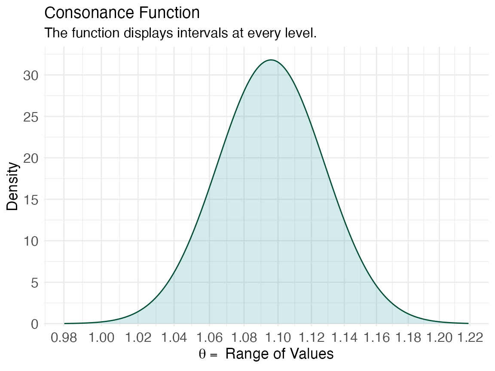
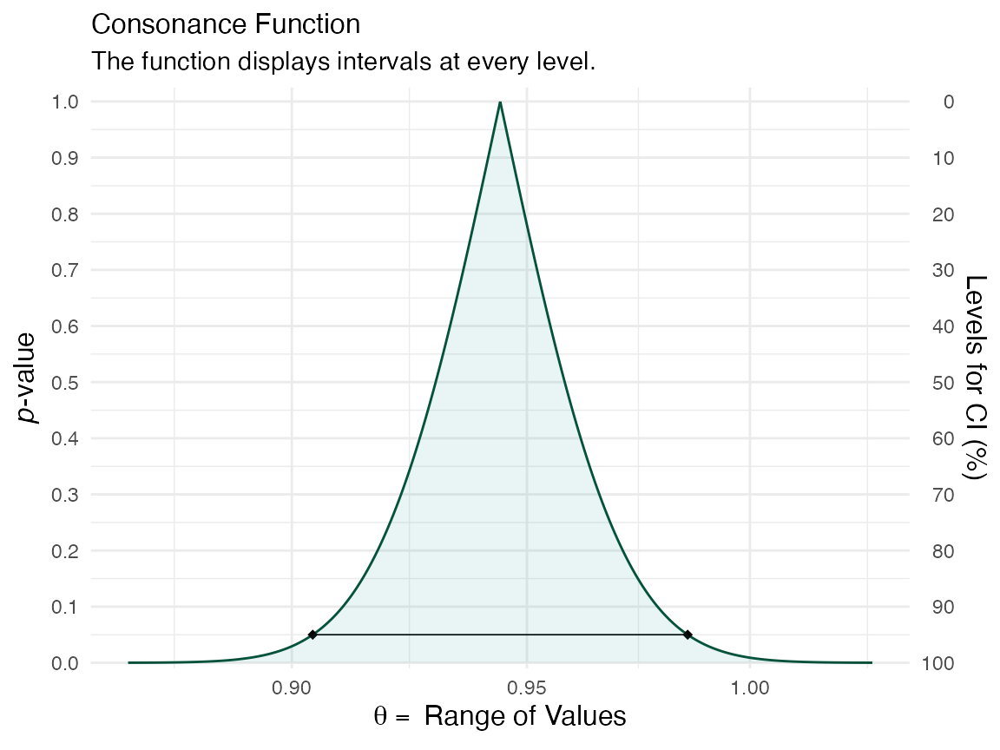
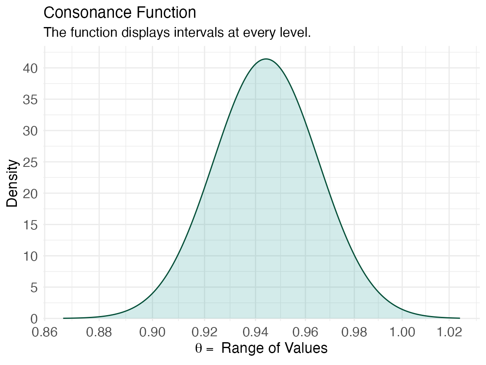

# Survival Modeling

Here, we’ll look at how to create consonance functions from the
coefficients of predictors of interest in a Cox regression model.

We’ll use the `carData` package for this. [Fox & Weisberg,
2018](https://socialsciences.mcmaster.ca/jfox/Books/Companion/appendices/Appendix-Cox-Regression.pdf)
describe the dataset elegantly in their paper,

> The Rossi data set in the `carData` package contains data from an
> experimental study of recidivism of 432 male prisoners, who were
> observed for a year after being released from prison (Rossi et al.,
> 1980). The following variables are included in the data; the variable
> names are those used by Allison (1995), from whom this example and
> variable descriptions are adapted:
>
> **week**: week of first arrest after release, or censoring time.
>
> **arrest**: the event indicator, equal to 1 for those arrested during
> the period of the study and 0 for those who were not arrested.
>
> **fin**: a factor, with levels “yes” if the individual received
> financial aid after release from prison, and “no” if he did not;
> financial aid was a randomly assigned factor manipulated by the
> researchers.
>
> **age**: in years at the time of release.
>
> **race**: a factor with levels “black” and “other”.
>
> **wexp**: a factor with levels “yes” if the individual had full-time
> work experience prior to incarceration and “no” if he did not.
>
> **mar**: a factor with levels “married” if the individual was married
> at the time of release and “not married” if he was not.
>
> **paro**: a factor coded “yes” if the individual was released on
> parole and “no” if he was not.
>
> **prio**: number of prior convictions.
>
> **educ**: education, a categorical variable coded numerically, with
> codes 2 (grade 6 or less), 3 (grades 6 through 9), 4 (grades 10 and
> 11), 5 (grade 12), or 6 (some post-secondary).
>
> **emp1–emp52**: factors coded “yes” if the individual was employed in
> the corresponding week of the study and “no” otherwise.
>
> We read the data file into a data frame, and print the first few cases
> (omitting the variables **emp1 – emp52**, which are in columns 11–62
> of the data frame):

``` r

library(concurve)
#> Please see the documentation on https://data.lesslikely.com/concurve/ or by typing `help(concurve)`
library(carData)
Rossi[1:5, 1:10]
#>   week arrest fin age  race wexp         mar paro prio educ
#> 1   20      1  no  27 black   no not married  yes    3    3
#> 2   17      1  no  18 black   no not married  yes    8    4
#> 3   25      1  no  19 other  yes not married  yes   13    3
#> 4   52      0 yes  23 black  yes     married  yes    1    5
#> 5   52      0  no  19 other  yes not married  yes    3    3
```

> Thus, for example, the first individual was arrested in week 20 of the
> study, while the fourth individual was never rearrested, and hence has
> a censoring time of 52. Following Allison, a Cox regression of time to
> rearrest on the time-constant covariates is specified as follows:

``` r

library(survival)
mod.allison <- coxph(Surv(week, arrest) ~
fin + age + race + wexp + mar + paro + prio,
data = Rossi
)
mod.allison
#> Call:
#> coxph(formula = Surv(week, arrest) ~ fin + age + race + wexp + 
#>     mar + paro + prio, data = Rossi)
#> 
#>                    coef exp(coef) se(coef)      z       p
#> finyes         -0.37942   0.68426  0.19138 -1.983 0.04742
#> age            -0.05744   0.94418  0.02200 -2.611 0.00903
#> raceother      -0.31390   0.73059  0.30799 -1.019 0.30812
#> wexpyes        -0.14980   0.86088  0.21222 -0.706 0.48029
#> marnot married  0.43370   1.54296  0.38187  1.136 0.25606
#> paroyes        -0.08487   0.91863  0.19576 -0.434 0.66461
#> prio            0.09150   1.09581  0.02865  3.194 0.00140
#> 
#> Likelihood ratio test=33.27  on 7 df, p=2.362e-05
#> n= 432, number of events= 114
```

Now that we have our Cox model object, we can use the
[`curve_surv()`](reference/curve_surv.md) function to create the
function.

If we wanted to create a function for the coefficient of prior
convictions, then we’d do so like this:

``` r

z <- curve_surv(mod.allison, "prio")
```

Then we could plot our consonance curve and density and also produce a
table of relevant statistics. Because we’re working with ratios, we’ll
set the `measure` argument in [`ggcurve()`](reference/ggcurve.md) to
“`ratio`”.

``` r

ggcurve(z[[1]], measure = "ratio", nullvalue = TRUE)
#> Warning: Using `size` aesthetic for lines was deprecated in ggplot2 3.4.0.
#> ℹ Please use `linewidth` instead.
#> ℹ The deprecated feature was likely used in the concurve package.
#>   Please report the issue at <https://github.com/zadrafi/concurve/issues>.
#> This warning is displayed once per session.
#> Call `lifecycle::last_lifecycle_warnings()` to see where this warning was
#> generated.
```


``` r

ggcurve(z[[2]], type = "cd", measure = "ratio", nullvalue = TRUE)
```



``` r

curve_table(z[[1]], format = "image")
```

| Lower Limit | Upper Limit | Interval Width | Interval Level (%) | CDF | P-value | S-value (bits) |
|----|----|----|----|----|----|----|
| 1.086 | 1.106 | 0.020 | 25.0 | 0.625 | 0.750 | 0.415 |
| 1.075 | 1.117 | 0.042 | 50.0 | 0.750 | 0.500 | 1.000 |
| 1.060 | 1.133 | 0.072 | 75.0 | 0.875 | 0.250 | 2.000 |
| 1.056 | 1.137 | 0.080 | 80.0 | 0.900 | 0.200 | 2.322 |
| 1.052 | 1.142 | 0.090 | 85.0 | 0.925 | 0.150 | 2.737 |
| 1.045 | 1.149 | 0.103 | 90.0 | 0.950 | 0.100 | 3.322 |
| 1.036 | 1.159 | 0.123 | 95.0 | 0.975 | 0.050 | 4.322 |
| 1.028 | 1.168 | 0.141 | 97.5 | 0.988 | 0.025 | 5.322 |
| 1.018 | 1.180 | 0.162 | 99.0 | 0.995 | 0.010 | 6.644 |

We could also construct a function for another predictor such as age

``` r

x <- curve_surv(mod.allison, "age")
ggcurve(x[[1]], measure = "ratio")
```



``` r

ggcurve(x[[2]], type = "cd", measure = "ratio")
```



``` r

curve_table(x[[1]], format = "image")
```

| Lower Limit | Upper Limit | Interval Width | Interval Level (%) | CDF | P-value | S-value (bits) |
|----|----|----|----|----|----|----|
| 0.938 | 0.951 | 0.013 | 25.0 | 0.625 | 0.750 | 0.415 |
| 0.930 | 0.958 | 0.028 | 50.0 | 0.750 | 0.500 | 1.000 |
| 0.921 | 0.968 | 0.048 | 75.0 | 0.875 | 0.250 | 2.000 |
| 0.918 | 0.971 | 0.053 | 80.0 | 0.900 | 0.200 | 2.322 |
| 0.915 | 0.975 | 0.060 | 85.0 | 0.925 | 0.150 | 2.737 |
| 0.911 | 0.979 | 0.068 | 90.0 | 0.950 | 0.100 | 3.322 |
| 0.904 | 0.986 | 0.081 | 95.0 | 0.975 | 0.050 | 4.322 |
| 0.899 | 0.992 | 0.093 | 97.5 | 0.988 | 0.025 | 5.322 |
| 0.892 | 0.999 | 0.107 | 99.0 | 0.995 | 0.010 | 6.644 |

That’s a very quick look at creating functions from Cox regression
models.

## Cite R Packages

Please remember to cite the packages that you use.

``` r

citation("concurve")
#> To cite package 'concurve' in publications use:
#> 
#>   Rafi Z, Vigotsky A (2026). _concurve: Computes and Plots
#>   Compatibility (Confidence) Intervals, P-Values, S-Values, &
#>   Likelihood Intervals to Form Consonance, Surprisal, & Likelihood
#>   Functions_. R package version 3.0.0,
#>   <https://CRAN.R-project.org/package=concurve>.
#> 
#>   Rafi Z, Greenland S (2020). "Semantic and Cognitive Tools to Aid
#>   Statistical Science: Replace Confidence and Significance by
#>   Compatibility and Surprise." _BMC Medical Research Methodology_,
#>   *20*, 244. ISSN 1471-2288, doi:10.1186/s12874-020-01105-9
#>   <https://doi.org/10.1186/s12874-020-01105-9>,
#>   <https://doi.org/10.1186/s12874-020-01105-9>.
#> 
#> To see these entries in BibTeX format, use 'print(<citation>,
#> bibtex=TRUE)', 'toBibtex(.)', or set
#> 'options(citation.bibtex.max=999)'.
citation("survival")
#> To cite package 'survival' in publications use:
#> 
#>   Therneau T (2026). _A Package for Survival Analysis in R_. R package
#>   version 3.8-6, <https://CRAN.R-project.org/package=survival>.
#> 
#>   Terry M. Therneau, Patricia M. Grambsch (2000). _Modeling Survival
#>   Data: Extending the Cox Model_. Springer, New York. ISBN
#>   0-387-98784-3.
#> 
#> To see these entries in BibTeX format, use 'print(<citation>,
#> bibtex=TRUE)', 'toBibtex(.)', or set
#> 'options(citation.bibtex.max=999)'.
citation("carData")
#> To cite package 'carData' in publications use:
#> 
#>   Fox J, Weisberg S, Price B (2022). _carData: Companion to Applied
#>   Regression Data Sets_. doi:10.32614/CRAN.package.carData
#>   <https://doi.org/10.32614/CRAN.package.carData>, R package version
#>   3.0-5, <https://CRAN.R-project.org/package=carData>.
#> 
#> A BibTeX entry for LaTeX users is
#> 
#>   @Manual{,
#>     title = {carData: Companion to Applied Regression Data Sets},
#>     author = {John Fox and Sanford Weisberg and Brad Price},
#>     year = {2022},
#>     note = {R package version 3.0-5},
#>     url = {https://CRAN.R-project.org/package=carData},
#>     doi = {10.32614/CRAN.package.carData},
#>   }
citation("survminer")
#> To cite package 'survminer' in publications use:
#> 
#>   Kassambara A, Kosinski M, Biecek P (2025). _survminer: Drawing
#>   Survival Curves using 'ggplot2'_. doi:10.32614/CRAN.package.survminer
#>   <https://doi.org/10.32614/CRAN.package.survminer>, R package version
#>   0.5.1, <https://CRAN.R-project.org/package=survminer>.
#> 
#> A BibTeX entry for LaTeX users is
#> 
#>   @Manual{,
#>     title = {survminer: Drawing Survival Curves using 'ggplot2'},
#>     author = {Alboukadel Kassambara and Marcin Kosinski and Przemyslaw Biecek},
#>     year = {2025},
#>     note = {R package version 0.5.1},
#>     url = {https://CRAN.R-project.org/package=survminer},
#>     doi = {10.32614/CRAN.package.survminer},
#>   }
```

------------------------------------------------------------------------

## References

------------------------------------------------------------------------
