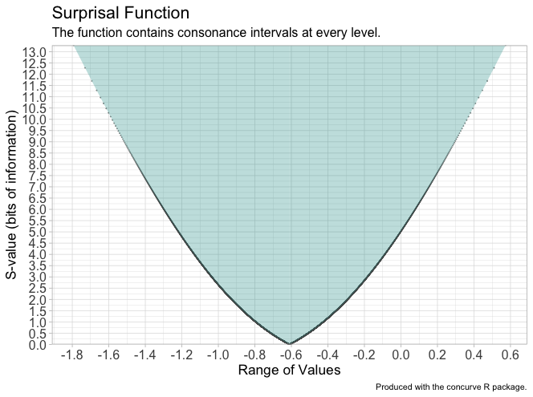
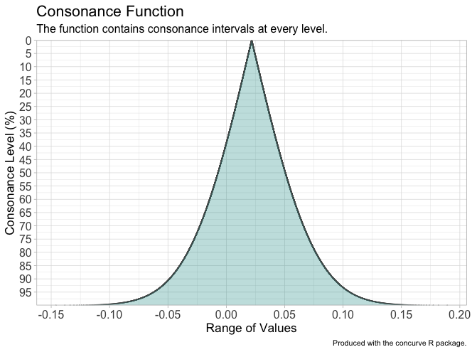
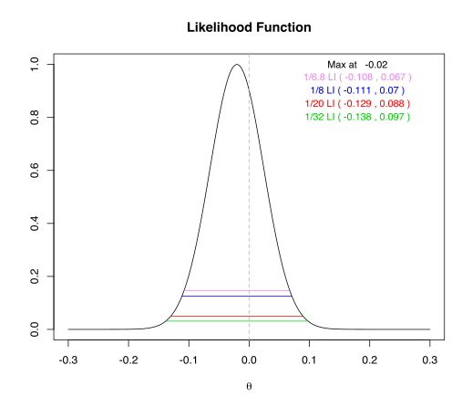
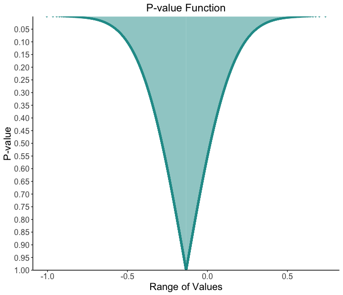
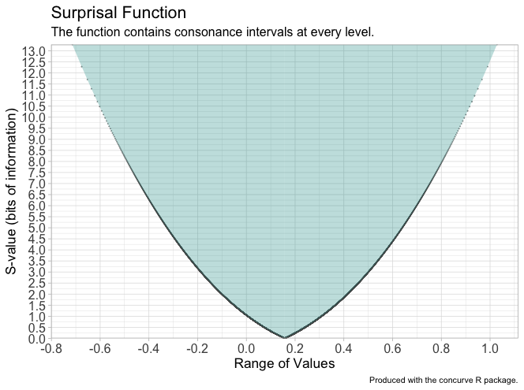

```{r setup, include = FALSE}
knitr::opts_chunk$set(
  collapse = TRUE,
  comment = "#>"
)
```

## Using Mean Differences

If we were to simulate some random data from a normal distribution with
the following code,

``` r
GroupA<-rnorm(15)
GroupB<-rnorm(15)

RandomData<-data.frame(GroupA, GroupB)
```

and compare the means of these two groups using Welch’s t-test,

``` r
testresults<-t.test(GroupA, GroupB, data=RandomData, paired=FALSE)
```

we would likely see some differences, given that we have such a small
sample in each group. We can graph our data to see what the variability
looks like.

Plotted with a dot plot, we would see some variability.


```r
summary(testresults)
```

We can see our P-value for the statistical test along with the computed
95% interval (which is given to us by default by the program). Thus,
effect sizes that range from the lower bound of this interval to the
upper bound are compatible with the test model at this compatibility
level.

However, as stated before, a 95% interval is only an artifact of the
commonly used 5% alpha level for hypothesis testing and is nowhere near
as informative as a function.

If we were to take the information from this data and calculate a
P-value function where every single compatibility interval and its
corresponding P-value were plotted, we would be able to see the full
range of effect sizes compatible with the test model at various levels.

It is relatively easy to produce such a function using the
<span style="color:#d46c5b">[**concurve**](https://github.com/Zadchow/concurve)</span>
package in R.

Install the concurve package. 

``` r
library(devtools)
install_github("zadchow/concurve")

```

We’ll use the same data from above to calculate a P-value function and
since we are focusing on mean differences using a t-test, we will use
the ***meanintervals*** function to calculate our compatibility
intervals function and store it in a dataframe.

``` r
library(concurve)
intervalsdf<-meanintervals(GroupA, GroupB, 
                           data=RandomData, method="default")
```

Now thousands of compatibility intervals at various levels have been
stored in the dataframe “intervalsdf.”

We can plot this data using the ***plotpint*** function (which stands
for plot P-value intervals).

``` r
pfunction<-plotpint(intervalsdf)
pfunction
```


Now we can see every compatibility interval and its corresponding
P-value and compatibility level plotted. As stated before, a single 95%
compatibility interval is simply a slice through this function, which
provides far more information as to what is compatible with the test
model and its assumptions.

Furthermore, we can also plot every compatibility interval and its
corresponding
<span style="color:#d46c5b">[***S-value***](https://www.lesslikely.com/statistics/s-values/)</span>
using the ***plotsint*** function

``` r
sfunction<-plotsint(intervalsdf)
sfunction
```


The graph from the code above provides us with compatibility levels and the maximum
amount of information against the effect sizes contained in the
compatibility interval.

## Simple Linear Models

We can also try this with other simple linear models.

Let’s simulate more normal data and fit a simple linear regression to it
using ordinary least squares regression with the ***lm*** function.

``` r

GroupA2<-rnorm(500)
GroupB2<-rnorm(500)

RandomData2<-data.frame(GroupA2, GroupB2)

model<-lm(GroupA2 ~ GroupB2, data=RandomData2)
summary(model)
```

We can see some of the basic statistics of our model including the 95%
interval for our predictor (GroupB). Perhaps we want more information.
Well we can do that\! Using the ***geninterval*** function in the
<span style="color:#d46c5b">[**concurve**](https://github.com/Zadchow/concurve)</span>
package, we can calculate several compatibility intervals for the
regression coefficient and then plot the P-value and S-value functions.

``` r
randomframe<-genintervals(model, "GroupB2")

plotpint(randomframe)
```



``` r
s<-plotsint(randomframe)
s
```


We can also compare these functions to likelihood functions (also called
support intervals), and we’ll see that we get very similar results.
We’ll do this using the ***ProfileLikelihood*** package.

``` r
xx <- profilelike.lm(formula = GroupA2 ~ 1, data=RandomData2, 
                     profile.theta="GroupB2",
                     lo.theta=-0.3, hi.theta=0.3, length=500)
```

Now we plot our likelihood function and we can see what the maximum
likelihood estimation is. Notice that it’s practically similar to the
interval in the S-value function with 0 bits of information against it
and and the compatibility interval in the P-value function with a
P-value of 1.

``` r
profilelike.plot(theta=xx$theta, 
                 profile.lik.norm=xx$profile.lik.norm, round=3)
title(main = "Likelihood Function")
```



We’ve used a relatively easy example for this blog post, but the
<span style="color:#d46c5b">[**concurve**](https://github.com/Zadchow/concurve)</span>
package is also able to calculate compatibility functions for multiple
regressions, logistic regressions, ANOVAs, and meta-analyses (that have
been produced by the ***metafor*** package).

## Using Meta-Analysis Data

Here we present another quick example with a meta-analysis of simulated
data.

First, we simulate random data for two groups in two hypothetical
studies

``` r
GroupAData<-runif(20, min=0, max=100)
GroupAMean<-round(mean(GroupAData), digits=2)
GroupASD<-round(sd(GroupAData), digits=2)

GroupBData<-runif(20, min=0, max=100)
GroupBMean<-round(mean(GroupBData), digits=2)
GroupBSD<-round(sd(GroupBData), digits=2)

GroupCData<-runif(20, min=0, max=100)
GroupCMean<-round(mean(GroupCData), digits=2)
GroupCSD<-round(sd(GroupCData), digits=2)

GroupDData<-runif(20, min=0, max=100)
GroupDMean<-round(mean(GroupDData), digits=2)
GroupDSD<-round(sd(GroupDData), digits=2)
```

We can then quickly combine the data in a dataframe.

``` r
StudyName<-c("Study1", "Study2")
MeanTreatment<-c(GroupAMean, GroupCMean)
MeanControl<-c(GroupBMean, GroupDMean)
SDTreatment<-c(GroupASD, GroupCSD)
SDControl<-c(GroupBSD, GroupDSD)
NTreatment<-c(20,20)
NControl<-c(20,20)

metadf<-data.frame(StudyName, MeanTreatment, MeanControl, 
                   SDTreatment, SDControl, 
                   NTreatment, NControl)
```

Then, we’ll use ***metafor*** to calculate the standardized mean
difference.

``` r
dat<-escalc(measure="SMD", 
            m1i=MeanTreatment, sd1i=SDTreatment, n1i=NTreatment,
            m2i=MeanControl, sd2i=SDControl, n2i=NControl, 
            data=metadf)
```

Next, we’ll pool the data using a ~~fixed-effects~~ common-effects model

``` r
res<-rma(yi, vi, data=dat, slab=paste(StudyName, sep=", "), 
         method="FE", digits=2)
```

Let’s plot our results in a forest plot. I’m going to omit this code
since it’s a bit long.


Take a look at the pooled summary effect and its interval. Keep it in
mind as we move onto constructing a compatibility function.

We can now take the object produced by the meta-analysis and calculate a
P-value and S-value function with it to see the full spectrum of effect
sizes compatible with the test model at every level. We’ll use the
***metainterval*** function to do this.

``` r
metaf<-metaintervals(res)
```

Now that we have our dataframe with every computed interval, we can plot
the functions.

``` r
plotpint(metaf)
```



And our S-value function

``` r
plotsint(metaf)
```


Compare the span of these functions and the information they provide to
the compatibility interval provided by the forest plot. We are now no
longer limited to interpreting an arbitrarily chosen interval by
mindless analytic decisions often built into statistical packages by
default.
